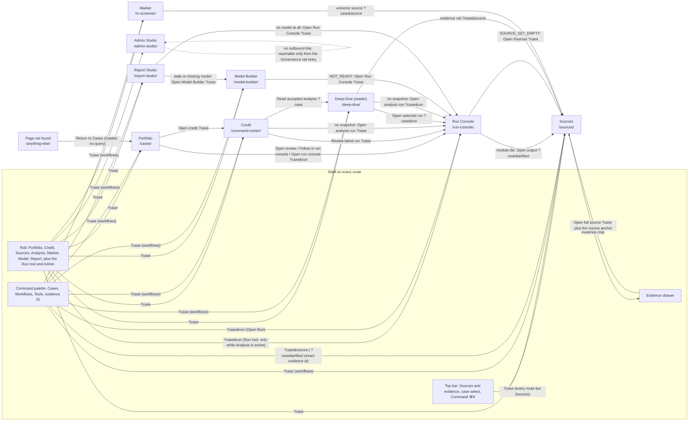

# FE-A1: information-architecture audit of the CAOS workbench

Date: 2026-09-05. Worktree `.claude/worktrees/frontend-ia-audit-84c3b6` at `ea42a2d` (main after PR #58). Assessment only: no source, test, style, script or plan file changed; no commit. Evidence under `.superpowers/sdd/frontend/evidence/a1/` (screenshots, `trace.json`, `trace-publication.json`, `trace-publication-intake-refusal.json`). The design brief for FE-D1 is `.superpowers/sdd/frontend/ia-design-brief.md`.

Two sentences of verdict, then the shape the prompt asked for. The workbench today is one shell over nine routes that carry four vocabularies for the same objects (URL, rail, kicker/title, tab title), one home for run progress and acceptance that only the rail's Analysis group can reach, and a governance layer whose served halves (member provisioning, the audit package) sit in Report Studio and in no surface at all while Admin declares them "Not served". The credible target is the rail's own eight words applied end to end with Run as an Analysis tool ("Align"); merging the run console into the reader ("Absorb") buys one word for the analyst at the cost of a data-selected surface and the largest test move.

## 1. Current-state map

Built from `caos/frontend/src/lib/workbench.ts` (`routeDestinations`, `destinationMeta`, `workflows`), `src/components/WorkbenchShell.tsx` (rail, palette, top bar, drawer), the destination switch and every `Link`/`withQuery` target in `src/components/Workspace.tsx`, `src/components/model/ModelBuilder.tsx`, `src/components/report/ReportStudio.tsx`, `src/components/states.tsx`, `app/not-found.tsx`, and the served routes in `caos/server/caos/api/__init__.py`. Kicker, page title, tab title and rail current entry were read from the running app (`trace.json` → `routes`).

### 1.1 Destinations

| Destination (`routeDestinations`) | Slug | Rail label (`workflows`) | Kicker (`destinationMeta`) | Page title (`h1`) | Tab title | Served contracts the surface calls | Primary action(s) rendered | Decision states rendered | Persona that owns it |
|---|---|---|---|---|---|---|---|---|---|
| Cases | `/cases/` | Portfolio | Portfolio / Surveillance | Monitored credits | CAOS — Cases | `GET /api/cases`, `POST /api/cases`, `POST /api/intake`, `GET /api/cases/{id}/intake` | "Analyze documents" plus one "Open credit" per register row (styled primary) plus "Create case" (primary when no case is selected): three page-level primaries | register loading / empty / filtered-empty; intake uploading, refused (alert with typed code and per-file findings), clarification, execution-unavailable, in-progress, paused, stopped, review; pathway-fit READY / NEEDS SOURCE / fit-unavailable; "Portfolio ordering is not yet governed."; reader | Analyst (intake), PM (register) |
| Command Center | `/command-center/` | Credit | Credit / Current state | Current state and what changed | CAOS — Command Center | `GET /api/cases/{id}/lens`, `GET /api/cases/{id}/snapshot`, `GET /api/cases/{id}/artifacts/{id}` × accepted artifacts | "Read accepted analysis" | loading; unavailable (lens 404, snapshot 404); error; no-snapshot action ("Credit state unavailable" → "Open analysis run"); observed-empty ("No material module or source-set change…"); stale/diff ("Navigation does not switch authority"); partial ("Some accepted module outputs could not be loaded"); unavailable ("Binding measure and claim gaps") | PM |
| Sources | `/sources/` | Sources | Sources / Evidence | Documents, extraction and coverage | CAOS — Sources | `GET /api/cases/{id}/sources`, `POST /api/cases/{id}/sources`, `GET /api/cases/{id}/artifacts/{id}` (with `?artifact`) | "Upload and version" | loading; error; empty; "Evidence … is not in the active case source set" (alert); unavailable ("Claim coverage"); reader | Analyst, QA |
| Run Console | `/run-console/` | Run (tool under Analysis) | Analysis / Execution | Run and acceptance | CAOS — Run Console | `POST /api/cases/{id}/runs`, `GET /api/runs/{id}`, `GET /api/runs/{id}/events` (SSE), `POST /api/runs/{id}/accept`, `POST /api/runs/{id}/resume`, `POST /api/runs/{id}/research-plan/approve` | "Compile and run" and "Accept analytical snapshot" (two primaries), "Approve research plan" while paused | "No current execution"; queued/running (progress bar, module tiles); paused: SOURCE_SET_EMPTY (→ Sources), PLAN_APPROVAL_REQUIRED (plan view), generic (Resume), resume-unavailable, approval-unavailable; failed (typed refusal); succeeded-unaccepted ("Ready for acceptance"); accepted ("Latest accepted authority", with or without "switch required"); reader | Analyst |
| Deep-Dive | `/deep-dive/` | Analysis | Analysis / Reader | Accepted analysis | CAOS — Deep-Dive | `GET /api/cases/{id}/snapshot`, `GET /api/cases/{id}/artifacts/{id}` × accepted artifacts, `POST /api/cases/{id}/snapshot/switch` | none by default; "Switch visible snapshot" only when the server says `switch_required` | loading; no-snapshot action ("Analysis unavailable" → "Open analysis run"); switch-required callout; partial; unavailable ("Evidence citations") | Analyst, PM |
| RV Screener | `/rv-screener/` | Market | Market / Comparison | Governed loan universe | CAOS — RV Screener | `GET /api/cases/{id}/rv/loan-universes/active`, `POST /api/cases/{id}/sources`, `POST /api/cases/{id}/rv/loan-universes` | "Upload CP-3 workbook" | loading; error; empty ("Upload the fixed CP-3 workbook…"); findings (alert, code/sheet/row); filtered-empty; "Relative percentile unavailable"; reader | Analyst (Relative Value) |
| Model Builder | `/model-builder/` | Model | Model / Forecast | Assumptions, lineage and sign-off | CAOS — Model Builder | `GET /api/cases/{id}/model`, `GET`/`POST /api/cases/{id}/models`, `GET …/models/{id}/worksheet`, `GET …/models/assumption-registry`, `POST …/models/previews`, `POST …/model-revisions/sign-off`, `GET …/model-revisions`, `POST …/model-revisions/rebase-preview`, `POST …/models/tornado`, `POST …/models/{id}/export`, `GET …/models/{id}/download`, `POST`/`GET …/model-revisions/{id}/export|download`, `GET …/model-revisions/export-statuses` | one at a time: "Build model" → "Recalculate forecast" → "Save model version" | loading; unavailable (load error); NOT_READY (with "Open Run Console"); CANONICAL_MODEL_INPUTS_INVALID (no way out, see F-09); READY_TO_BUILD; QUEUED/BUILDING; FAILED; READY; "Model authority changed" (conflict); STALE revision (Rebase); unavailable (worksheet, tornado, rebase, export, download) | Analyst |
| Report Studio | `/report-studio/` | Report | Report / Publication | Compose, freeze and file | CAOS — Report Studio | `GET`/`PUT …/deliverables/{pathway}/draft`, `GET …/sources`, `GET …/models/assumption-registry`, `POST …/models/scenarios`, `POST …/deliverables/{pathway}/opinion`, `POST …/freeze`, `GET …/freeze-jobs/{id}`, `POST …/by-id/{id}/approve`, `POST …/request-changes`, `GET …/receipt`, `GET …/export/{format}`, `POST /api/cases/{id}/members` | "Freeze saved vN" (analyst); "File exact Frozen version" (independent approver); "Retry save now" (recovery copy) | loading; error; save states IDLE / INCOMPLETE / DIRTY / SAVING / SAVED / CONFLICT / ERROR; recovery copy; "Stale model identity"; DELIVERABLE_PATHWAY_AUTHORITY_MISMATCH (typed); immutable FROZEN review with separation-of-duties line; pending/failed freeze job; FILED with detached receipt and MD/PDF/XLSX; reader | Analyst (compose, sign, freeze), Approver (file), QA (provisioning) |
| Admin Studio | `/admin-studio/` | Admin (Governance group) | Admin / Governance | Deployment capability | CAOS — Admin Studio | none | none | unavailable only ("UNAVAILABLE"; four "Not served" rows) | QA |

Shell contracts on every route: `GET /api/me`, `GET /api/cases`, `GET /api/cases/{id}`, `GET /api/cases/{id}/snapshot` (the authority strip).

Served routes no surface calls (orphans on the wire): `GET /api/runs/{id}/research-plan` (the plan rides `GET /api/runs/{id}`), `POST /api/runs/{id}/upgrade`, `POST`/`GET /api/cases/{id}/notes` and `…/promote`, `POST /api/cases/{id}/sources/{id}/withdraw`, `GET /api/cases/{id}/sources/{id}`, `GET`/`POST /api/cases/{id}/rv`, `GET /api/cases/{id}/deliverables/revisions/{id}`, `POST /api/cases/{id}/models/sensitivities/one-way`, `GET /api/cases/{id}/audit-package`.

### 1.2 The five query parameters

| Parameter | Read by | Written by | Effect |
|---|---|---|---|
| `case` | `Workspace.tsx:56` → reducer `hydrate`; every `withQuery` target | every rail, palette, top-bar and in-page link; `replaceState` on every authority change (`Workspace.tsx:673-684`) | selects the case through the reducer; a stale replay is fenced (`routeAuthorityRef`) |
| `run` | `Workspace.tsx:57` | rail "Run" tool link, intake evidence links, Deep-Dive "Open selected run", `replaceState` | selects the run; an explicit `run` for the same case wins; a run from another case is invalidated with a 404-style message |
| `q` | `Workspace.tsx:58`; rendered as an "Evidence request" strip on Command Center (`:1834`) and Deep-Dive (`:1670`) | nothing in the tree (only the smoke's `history.pushState`, lines 502 and 517) | display only |
| `artifact` | `Workspace.tsx:59` → Sources "Evidence focus" panel | Run Console DAG tiles (`:1495`), palette evidence-ID search | opens one module output above the source register |
| `source` | `Workspace.tsx:60` → Sources selected source | Deep-Dive evidence rail (`:1677`), RV universe source link (`:1779`), palette evidence-ID search | selects a source in the register |

Test-only parameters the export also honours because the scripts intercept routes by URL, never by the app: `fixture=`, `state=`, `role=`, `prerequisite=` (`workbench-smoke.mjs:731, 1405, 1429, 1772`; `a11y-axe.mjs:101, 139, 231, 283-318`).

### 1.3 Navigation graph

Edges the graph does not have: nothing links to Admin except the rail; nothing links from Report to Sources except the top bar; nothing in the tree writes `q`; no surface links to the audit package. Every in-page link carries `case`; only the Run tool, the intake evidence block and Deep-Dive's "Open selected run" carry `run`.

## 2. Task-flow traces

Method: a Playwright script (`ia-trace.mjs`, retained in the scratch directory and reproduced in §8) drove the host-control app on `:8768` with the worker beside it, recorded every main-frame navigation, the kicker and title, the authority strip, click count per step, and took a full-page screenshot per step. A destination change is a pathname change; an authority change is a change in the strip's four facts. The first pass used the smoke's synthetic three-document pack; the publication leg (§2.2) used the 30-document Carnival corpus because the synthetic pack cannot reach a READY model (F-09). Totals for the first pass: 49 steps, 41 clicks, 32 destination changes, 12 authority changes, 266 recorded navigations, 7 failed steps (all in the model and report legs, explained in F-09 and F-10).

### 2.1 Golden journey, analyst (UX-001 to UX-020)

| # | Step | Surface after | Clicks | Dest. change | Authority change | Friction (id) |
|---|---|---|---|---|---|---|
| 1 | Open Portfolio, empty register | Portfolio | 0 | — | — | — |
| 2 | Drop three documents, "Analyze 3 documents" | Portfolio (`?case&run` written by intake) | 2 | no | yes (case and run adopted) | Intake evidence, route and manifest render in place (`02-portfolio-intake-evidence.png`). Three primaries on one page (F-01). |
| 3 | "Open review" from the intake panel | Run Console `?case&run` | 1 | yes | yes (strip now names the run) | The compile form beside the run shows "Earnings Update / Screen" for a Full Credit full-depth run (F-02). |
| 4 | Module tile "Open output" | Sources `?case&artifact` | 1 | yes | no | Evidence focus is a Sources page state; the run console is left to read an output (F-03). |
| 5 | Evidence chip → drawer | Sources (drawer open) | 1 | no | no | Drawer says "Source-level reference; no block locator supplied by this artifact" although the chip carried `b00001` (F-04). |
| 6 | Close drawer, browser back | Run Console | 2 | yes | no | — |
| 7 | "Accept analytical snapshot" | Run Console (dialog) | 1 | no | no | Dialog names run, pathway, source set, slots, replaced digest (`06-accept-dialog.png`). |
| 8 | Confirm | Run Console | 1 | no | yes ("Latest accepted authority") | — |
| 9 | Rail "Model" | Model Builder | 1 | yes | no | — |
| 10–11 | Build model, sign off | Model Builder | — | — | — | **Failed on the synthetic pack**: status "CANONICAL MODEL INPUTS INVALID" with no link out (F-09). Completed on the Carnival pack, §2.2. |
| 12 | Rail "Report" | Report Studio | 1 | yes | no | Opinion row "Blocked — No signed opinion yet." (`11-report-unsigned-opinion.png`). |
| 13–16 | Compose, sign, freeze | Report Studio | — | — | — | **Failed on the synthetic pack**: Full Credit needs a model; switching to a model-optional template is refused `DELIVERABLE PATHWAY AUTHORITY MISMATCH` (F-10). Completed on the Carnival pack, §2.2. |
| 17 | Signer sees no File control | Report Studio | 0 | no | no | Correct (UX-016). |

Intake to acceptance: 9 interactions, 3 destination changes (Portfolio → Run Console → Sources → Run Console), 3 authority changes. Every UX-001 to UX-010 behaviour observed: no analytical field asked (UX-001, UX-005), issuer and route derived and labelled (UX-002, UX-003), Full Credit at full depth by default (UX-003), automatic compile and start (UX-007), the completed review opened on request, never accepted on the analyst's behalf (UX-010).

Deep Research (the route with a human gate before execution):

| # | Step | Surface after | Clicks | Dest. change | Authority change | Friction |
|---|---|---|---|---|---|---|
| 24 | Drop annual, quarterly and a research-brief file | Portfolio | 2 | no | yes | — |
| 25 | Intake panel reports "Analysis is waiting on you" | Portfolio | 0 | no | no | The gate is announced on Portfolio but approved elsewhere (F-05). |
| 26 | "Open run console" | Run Console | 1 | yes | no | The plan renders below an "Acceptance blocked" panel that talks about acceptance before the plan is approved (`22-run-console-paused-plan-approval.png`, F-06). |
| 27 | "Approve research plan" | Run Console | 1 | no | no | Receipt "Research plan approved. Execution resumes against the approved plan hash." |
| 28 | Run completes | Run Console | 0 | no | yes | Succeeded, unaccepted; correct. |

### 2.2 Publication leg on the Carnival pack (model, opinion, freeze, provisioning, filing, receipt, audit package)

Two attempts, both recorded (`trace-publication-intake-refusal.json`, `trace-publication.json`, `trace-research-publication.json`).

**Attempt 1, Carnival pack, Full Credit.** The document-first path refuses the real pack: 30 files dropped unbound → `INTAKE_ISSUER_AMBIGUOUS` ("CARNIV AL CORPORATION & PLC; CARNIVAL CORPORATION & PLC; RELEASE OF CARNIVAL CORPORATION & PLC", `q01`); create the case by hand (4 interactions, `q02`); bind the pack to it → the same refusal, because the ambiguity check runs before binding (`q03`, F-17). The advanced path then works: 30 single-document uploads through the Sources route (the Sources form is one file per submit), Sources register (`q04`), rail Analysis → Run (two clicks, because Sources has no Run entry, F-15; `p01`), "Compile and run" Full Credit at full depth (`p02`), running (`p03`), succeeded in five seconds (`p04`), accepted (`p05`). Interactions from the refusal to acceptance: 2 + 4 + 3 + 30 + 1 + 2 + 4 + 2 = 48, six destination changes (Portfolio → Sources → Analysis → Run Console, then the dialog). Model Builder then reports `CANONICAL MODEL INPUTS INVALID` again (`p06`), so the Full Credit deliverable cannot be saved ("MODEL REQUIRED", `p10`) and nothing downstream is reachable. Root cause, verified in code: the development `host_control` binding answers every module with "Host-control orchestration proof; not analysis" (`caos/server/caos/engine/host_control.py:131-135`); only the test-only `CorpusProvider` in `caos/tests/test_corpus_pathways.py:202-294` emits the golden CP-MODEL fixtures. Consequence for the record: **no browser journey on a keyless server can reach a READY model, a signed revision, or a Full Credit freeze**; the workbench smoke drives those states against route fixtures (`workbench-smoke.mjs:1146-1175, 1757-1758, 2086`) and the a11y sweep against its `ready-model` and `ready-report` fixtures (F-20). Provisioning in Report Studio did work live (`p13`).

**Attempt 2, Deep Research pack (model optional), end to end, 0 failures.**

| # | Step | Persona | Surface after | Clicks | Dest. change | Authority change | Friction |
|---|---|---|---|---|---|---|---|
| 1 | Accept the succeeded research run (dialog + confirm) | analyst | Run Console | 2 | — | yes | — |
| 2 | Rail "Report", choose the Deep Research template | analyst | Report Studio | 2 | yes | no | Report opens on Full Credit whatever the case's accepted pathway; the frozen/filed history is pathway-scoped (F-19). The run console's "Snapshot accepted…" receipt is still on screen on Report (`r02`). |
| 3 | Compose seven required sections, "Omit model", autosave | analyst | Report Studio | 7 | no | no | "Saved v1" (`r03`). |
| 4 | Sign the opinion (four fields) | analyst | Report Studio | 1 | no | no | "Opinion signed on saved Draft v1." Opinion row "Ready" (`r04`, UX-016). |
| 5 | "Freeze saved v1" | analyst | Report Studio | 1 | no | no | Worker published in 3 s; "Immutable FROZEN review · Draft v1", "Pending approval · the frozen bytes never name an approver", paper watermark PENDING APPROVAL, no File control for the signer (`r05`, UX-016). |
| 6 | Provision the approver (seeded case admin; pathway select, subject, role, submit) | qa | Report Studio | 3 | (persona) | no | Lives in Report Studio under the freeze panel (`r06`, F-11/F-12). |
| 7 | Approver opens the FROZEN record | approver | Report Studio | 2 | (persona) | no | Must first switch the pathway template to find it (`r07`, F-19). |
| 8 | "File exact Frozen version" | approver | Report Studio | 1 | no | no | "Immutable FILED review", receipt `rcpt-76104fd7…` with digest, MD/PDF/XLSX unlocked (`r08`, UX-017). |
| 9 | Audit package | qa | API only | 0 | — | — | `200 application/zip`, 172,283 bytes, `x-caos-sha256` set; no surface (F-11). |
| 10 | Analyst returns to the FILED record | analyst | Report Studio | 1 | no | no | `r09`. |

Totals for the publication leg: 20 interactions across three personas, one destination change for the analyst (Run Console → Report), zero authority changes after acceptance. Every gate kept its identity: acceptance dialog, opinion sign-off, freeze, filing, receipt. Screens for the brief: `r02` (unsigned opinion), `r05` (frozen, pending approval), `r08` (filed with receipt).

### 2.3 PM scan (Portfolio → Credit → what changed → evidence)

| # | Step | Surface after | Clicks | Dest. change | Authority change | Friction |
|---|---|---|---|---|---|---|
| 29 | Portfolio register | Portfolio | 0 | — | — | Register is unranked by design ("Portfolio ordering is not yet governed."). "Authority" column is the only signal. |
| 30 | "Open credit" | Credit | 1 | yes | no | Conclusion, accepted snapshot, source set, module count, evidence count, "What changed" (`26-credit-accepted.png`). The diff compares the visible and latest accepted snapshots only; there is no "since I last looked" (F-07). |
| 31 | "Read accepted analysis" | Deep-Dive | 1 | yes | no | Reader with module list and evidence rail. |
| 32 | Evidence rail link | Sources `?case&source` | 1 | yes | no | Lands on the register with the source selected; the block the reader cited is not scrolled to (F-04). |
| 33 | Credit for a credit with no accepted snapshot | Credit | 0 | yes | yes | "Credit state unavailable" → "Open analysis run": the PM is sent to the analyst's console (F-08). |

Three clicks and three destinations for the scan; zero authority changes, as the plan requires ("navigation changes visibility, not authority").

### 2.4 QA path (coverage, evidence, audit, member provisioning)

| Task | Where it lives today | Clicks from the rail | Friction |
|---|---|---|---|
| Coverage | Sources → "Claim coverage — Not available in this deployment." (`17-sources-coverage-unavailable.png`) | 1 | Honest unavailable state; the QA persona has no coverage surface. |
| Evidence | Sources register, reader, drawer | 1–2 | As §2.1. |
| Audit trail | Admin → "AUDIT TRAIL — Not served" (`16-admin-unavailable.png`) | 1 | Contradicted by the served `GET /api/cases/{id}/audit-package`: the package downloaded with `200`, `application/zip`, 37,638 bytes, `x-caos-sha256` set, from the API only. No surface offers it (F-11). |
| Member provisioning | Report Studio → "Provision a distinct approver (subject)" form, visible only to a subject with stored case APPROVER/ADMIN standing and a current approver/admin role (`15-report-provision-approver.png`) | 1 (Report) | Admin says "MEMBERSHIP — Not served" while the route is served and used (F-11). The first APPROVER/ADMIN standing on a case cannot be created through any served route: `create_case` stores the creator as ANALYST (`store.py:570`), `POST …/members` requires stored APPROVER/ADMIN standing (`api/__init__.py:1213-1226`), and the test named "without database seeding" seeds `case-admin` through the store first (`test_publication_spec.py:245`). This trace seeded `qa-lead` the same way (F-12). The form offers APPROVER and ADMIN only; a READER cannot be provisioned (F-12). |

### 2.5 Reader's read-only path (UX-015)

Nine routes loaded with `x-caos-role: READER` (same subject). Zero file inputs on every route; the only primary-styled controls were links ("Open credit" on Portfolio, "Read accepted analysis" on Credit). Portfolio, Sources, Run Console and Market replace their write panels with "Reader access: … is an analyst action."; Report Studio disables the editor and shows "Reader mode · Freeze is an analyst action"; Model Builder and Deep-Dive show nothing about the missing controls (F-13). Screenshots `32-reader-run-console.png`, `33-reader-report.png`.

### 2.6 Shell checks

720 px (200 % zoom): no page-level horizontal overflow on Run Console, Report Studio or Portfolio (`overflow720RunConsole: false`, `overflow720Report: false`); the rail becomes a horizontal strip whose wordmark scrolls off to keep the active entry visible (`34-shell-720-run-console.png`, `36-shell-720-portfolio.png`). Unknown route keeps the shell, the case selection and the title "Page not found" (`37-unknown-route.png`, WEB-003). The palette offers CASES (2), WORKFLOWS (7: Open Portfolio … Open Report) and TOOLS (Open Run); Admin is absent from it (`38-command-palette.png`).

### 2.7 Friction register

| Id | Friction | Check | Evidence |
|---|---|---|---|
| F-01 | Portfolio renders three page-level primaries (Analyze documents, Open credit per row, Create case when no case is selected); DESIGN.md's anatomy allows one. | UX-011, WEB-008 | `trace.json` routes[cases].primaryButtons; `02-portfolio-intake-evidence.png` |
| F-02 | Run Console always shows the compile form with its own defaults (Earnings Update / Screen) beside a run the intake selected (Full Credit / full). The advanced control competes with the governed result for the eye and the primary action. | UX-011, UX-012 | `03-run-console-succeeded-unaccepted.png` |
| F-03 | Reading one module output before acceptance leaves the run console for Sources (`?artifact`); returning is browser-back. The "Evidence focus" panel is a Sources state, not an Analysis state. | UX-011 | steps 4–6 |
| F-04 | Evidence chips carry block ids, but the drawer's copy is hard-coded "Source-level reference; no block locator supplied by this artifact" (`WorkbenchShell.tsx:236`) and the Sources `?source` landing does not select the cited block. | UX-011, WEB-008 | `05-sources-evidence-drawer-open.png`, step 32 |
| F-05 | The research-plan gate is announced on Portfolio ("Analysis is waiting on you") and approved on Run Console; the rail's LIVE badge is off while paused, so a returning analyst has no rail signal that a gate waits. | UX-004, UX-008 | steps 25–26 |
| F-06 | While paused for plan approval, the run console leads with "Acceptance blocked — Review and approve the persisted research plan below" and puts the plan and its primary action below the fold of a 2,459 px page. | UX-011 | `22-run-console-paused-plan-approval.png` |
| F-07 | Credit's "What changed" is the served diff between the visible and latest accepted snapshots; when they coincide it says "No material module or source-set change…" even right after a new acceptance. The PM's question "what changed since I last looked" has no served answer (portfolio summary and claim map are unserved by decision). | UX-011 | `26-credit-accepted.png`, `whatChanged` note |
| F-08 | A PM opening a credit with no accepted snapshot is sent to "Open analysis run", the analyst's console, rather than to a read-only view of the latest run. | UX-015 | `29-credit-unavailable-no-snapshot.png` |
| F-09 | Model Builder dead-ends on `CANONICAL MODEL INPUTS INVALID`: the status is not NOT_READY, so the "Open Run Console" way out is not rendered and the blocker text ("Re-run Full Credit and accept it again") has no link. Reproduced with the synthetic pack: readiness reports all seven canonical artifacts MISSING although the accepted run has CP-1, CP-1A, CP-1B, CP-2, CP-2A and CP-2G succeeded (`/api/cases/{id}/model` vs `/api/runs/{id}` in §8). | UX-011, WEB-004 | `08-model-ready-to-build.png`, §8 curl output |
| F-10 | A Full Credit deliverable needs a model; without one the freeze checklist stays "Blocked" and switching to a model-optional template is refused `DELIVERABLE_PATHWAY_AUTHORITY_MISMATCH` — correct, but the surface offers the pathway select as if the choice were free. | UX-011 | `12-FAILED-report-draft-saved.png` |
| F-11 | Admin declares "Audit trail" and "Membership" not served; `GET /api/cases/{id}/audit-package` and `POST /api/cases/{id}/members` are served, the latter used from Report Studio, the former from nowhere. | UX-015, WEB-011 | `16-admin-unavailable.png`, `auditPackage` note |
| F-12 | No served route creates the first APPROVER/ADMIN standing on a case; the provisioning form lives in Report Studio and cannot provision a READER. | UX-016, UX-017 | §2.4 |
| F-13 | Model Builder and Deep-Dive say nothing to a reader about the write controls they hide; the other surfaces say "Reader access: …". | UX-015 | reader notes in `trace.json` |
| F-14 | A previously accepted run whose snapshot has been superseded by a later acceptance renders "Ready for acceptance" with a live "Accept analytical snapshot" button (`acceptedAuthorityMatch` matches only the latest accepted id). | UX-011, UX-017 | `34-shell-720-run-console.png`, `42-route-run-console.png` (first run after the second acceptance) |
| F-15 | The rail's "Run" tool exists only while an Analysis surface is active (`WorkbenchShell.tsx:277`); from Portfolio, Credit, Sources, Market, Model, Report and Admin the run console is two clicks away (Analysis, then Run) or a palette search. | UX-018, WEB-008 | `runToolVisibleOnSources: 0` in `trace-publication.json` |
| F-16 | Four vocabularies for one surface: URL `deep-dive`, rail "Analysis", kicker "Analysis / Reader", title "Accepted analysis", tab "CAOS — Deep-Dive"; the same for Cases/Portfolio/Monitored credits, Command Center/Credit/Current state, RV Screener/Market/Governed loan universe, Run Console/Run/Run and acceptance. | UX-011 | `trace.json` routes |
| F-17 | The document-first golden journey refuses the only real pack in the repository: `INTAKE_ISSUER_AMBIGUOUS` (the 10-K text layer splits "CARNIV AL"; a half-year cover reads "RELEASE OF …"), and the refusal's next action ("drop one issuer's documents at a time") cannot be followed because every file names the same issuer. Binding the pack to a created case does not help: the ambiguity check precedes binding (`intake/service.py:237-246`). The working path is the advanced one: create the case, upload each document through the Sources route, compile from the Run tool. | UX-001, UX-002, UX-004 | `q01-portfolio-carnival-refused-ambiguous.png`, `q03-portfolio-carnival-bound-refused.png`, `trace-publication-intake-refusal.json` |
| F-18 | The reader renders canonical markdown tables as raw pipe text (`markdownBlocks` knows headings and paragraphs only). Presentation, not IA; listed because it appears on the accepted reader the PM lands on. | WEB-010 | `27-deep-dive-accepted.png` |
| F-19 | Report Studio opens on the Full Credit template regardless of the case's accepted pathway, and the Draft, Frozen and Filed histories are scoped to the selected template; an approver who lands from a link sees no pending FROZEN record until they pick the right pathway. Nothing in the URL or the strip names the deliverable's pathway. | UX-017, WEB-003 | `r02`, `r07`; step 7 of §2.2 |
| F-20 | On a keyless server the model, sign-off and Full Credit publication legs are unreachable (host-control emits no CP-MODEL inputs), so the retained browser evidence for Model READY/STALE, the Full Credit freeze and its filing is route-mocked (smoke and a11y fixtures), not driven. An IA change to those surfaces cannot be proven live without a provider key or the corpus double. | WEB-002, WEB-004 | `p06`, `p10`, `host_control.py:131-135`, `workbench-smoke.mjs:1146-1175` |

## 3. Redundancy and orphan analysis

### 3.1 Surfaces that fetch the same authority

| Authority | Fetched by | Consequence |
|---|---|---|
| `GET /api/cases/{id}/snapshot` | shell `refreshCase` (`Workspace.tsx:377-400`), `CommandView` (`:1809`), `DeepDive` (`:1613`) | Three independent reads of the same object on Credit and Analysis; only the shell's read goes through the reducer's generation fence. A slow artifact fetch in `CommandView`/`DeepDive` can show a stale artifact set beside a fresh strip (the 31 Aug critique's minor observation; still true). |
| `GET /api/cases/{id}/artifacts/{id}` × accepted | `CommandView`, `DeepDive` | Both load every accepted artifact to find one conclusion (`selectConclusionArtifact`) or to fill a module list; nothing is shared between the two surfaces. |
| `GET /api/cases/{id}/sources` | `SourcesView`, `ReportStudio` (evidence inspector), `RVView` upload | Report Studio embeds its own evidence search over the same list Sources renders, with its own filter semantics. |
| `GET /api/cases/{id}/models/assumption-registry` | `ModelBuilder`, `ReportStudio` (scenario insertion) | Two scenario UIs: Model Builder's what-if and Report Studio's "Scenario insertion". |
| Run identity (`GET /api/runs/{id}`, SSE) | shell only | Correct: one owner. |

### 3.2 Surfaces and objects reachable only by URL or not at all

- `?q=` ("Evidence request" strip on Credit and Deep-Dive): read, never written; only the smoke pushes it.
- The audit package: served, downloadable, reachable from no surface (F-11).
- The research-plan record route, run upgrade, notes and promotion, source withdrawal, single-source read, the older RV workspace routes, deliverable revision read and one-way sensitivity: served, no caller (§1.1). One-way sensitivity is listed "Route absent" in `control-capability-map.md`.
- Admin: reachable only from the rail's Governance link; absent from the palette.
- A cited block: the evidence rail links to `?source=` and the drawer shows the first 20 blocks; no URL form addresses a block.
- Test parameters (`fixture`, `state`, `role`, `prerequisite`) are honoured by the scripts' route interception on the exported pages; the app itself ignores them.

### 3.3 Labels that name one object two ways (against `CONTEXT.md`)

| Object | Names in use | CONTEXT.md | Where |
|---|---|---|---|
| The reader of accepted analysis | Deep-Dive (slug, tab, `.impeccable.md`, `PRODUCT.md`), Analysis (rail), Analysis / Reader (kicker), Accepted analysis (title) | no term | F-16 |
| The execution and acceptance surface | Run Console (slug, tab, CLAUDE.md), Run (rail tool, palette), Analysis / Execution (kicker), Run and acceptance (title), "analysis run" (Credit and Deep-Dive links), "run console" (server `next_action` copy, `intake/service.py:371`) | no term | F-16 |
| The credit's current state | Command Center (slug, tab, `PRODUCT.md`, `.impeccable.md`), Credit (rail, strip), Credit / Current state (kicker), "Open credit" (Portfolio) | no term | F-16 |
| The register | Cases (slug, tab, palette group, "Select case", "Case" column), Portfolio (rail), Monitored credits (title, register header), "credit" (strip, "Credit" column) | no term | Portfolio |
| Market | RV Screener (slug, tab), Market (rail), Market / Comparison (kicker), Governed loan universe (title), Leveraged-loan universe, Loan screener (panels) | no term | Market |
| Accepted analytical authority | "snapshot" (server wire `SnapshotView`, "Accept analytical snapshot", "Visible snapshot", "Switch visible snapshot") | "Snapshot" is the avoid-term for Checkpoint; "Credit Snapshot" is a Deliverable section | Run Console, strip, Deep-Dive, Report template |
| The analyst's release of a model revision | Sign-Off / "Save model version" (button) / "Sign-Off Note" | Sign-Off (avoid: approval) | Model Builder |
| The approver's act | "File exact Frozen version", "Approval state", "Pending approval", route `approve` | Filed Deliverable; "Approval" is the avoid-term for Sign-Off but the plan reserves it for independent report approval | Report Studio |
| The analyst's gate on Deep Research | "Approve research plan" | no term (the plan calls it approval; it is a self-release like Sign-Off) | Run Console |
| Model | Model (rail), Model Builder (slug, title panel, tab, server docstrings), "Application model", Model Build (CONTEXT.md), "Application version" | Model Build | Model Builder, Report Studio |
| Report | Report (rail), Report Studio (slug, tab, `DESIGN.md`), Deliverable / Deliverable Draft (CONTEXT.md, panels) | Deliverable | Report Studio |
| Sources | Sources (rail, slug), Sources & evidence (top bar), Documents, extraction and coverage (title), "governed source" (upload label) | no term | Sources |

`caos/server/caos/contracts.py:72-81` pins `DESTINATIONS = ("Cases", "Sources", "Run Console", "Deep-Dive", "RV Screener", "Command Center", "Model Builder", "Report Studio")`: eight names, no Admin, no reader anywhere in the server or tests. A dead constant that would go stale twice under any rename.

## 4. Record reconciliation

| Intention | Source | Status | Evidence |
|---|---|---|---|
| Eight destinations: Portfolio, Credit, Sources, Analysis, Market, Model, Report, Admin | Production plan §4 table | Landed in the rail labels only; routes, kickers, titles and tabs keep nine | `workbench.ts:1-31, 98-106`; F-16 |
| Portfolio absorbs Cases and Command Center | §4 | Partly: the Command Center route carries the Credit reading the plan assigned to Credit; the triage half it assigned to Portfolio waits behind the portfolio-summary gate, so Portfolio is the register plus intake | `workflows` credit → `/command-center`; `Workspace.tsx:1072` |
| Analysis absorbs Run Console, Deep Dive and the Reader | §4 | Not landed: two routes; the rail groups them as Analysis plus a Run tool | `workflows[3]` |
| Core workflow Portfolio → Credit → Sources → Run → analysis → evidence → review → acceptance → Model / Report / Portfolio | §4 | Landed as links (Open credit; Read accepted analysis; module tile → Sources; accept dialog; rail Model and Report). Run is not on that path from Sources (F-15) | §1.3 |
| Shell retains case, visible version, accepted version, source-set identity and route; navigation never changes authority | §4, §9 | Landed: authority strip, reducer fence, "Navigation does not switch authority" copy | `WorkbenchShell.tsx:306-315`, §2.3 |
| Portfolio: attention order, binding metric, freshness behind a contract gate | §7.1, §8 | Landed as "Portfolio ordering is not yet governed." | `Workspace.tsx:1072` |
| Credit: accepted/candidate control, standing conclusion, measure/threshold, deltas, proof and gaps | §7.2 | Partly: conclusion, diff, proof rail landed; measure/threshold/counterfactual "Not available"; the candidate is a link ("Review latest run") not a delta | `Workspace.tsx:1836-1845` |
| Sources: register, reader, locator, coverage only when served | §7.3 | Landed; coverage unavailable | `Workspace.tsx:1218-1222` |
| Analysis reader: candidate/accepted state, conclusion, citations | §7.4 | Landed in Deep-Dive for accepted; the candidate review is the run console's "Evidence focus" on Sources (F-03) | §2.1 |
| Market: only served fields, no percentile | §7.5 | Landed | `Workspace.tsx:1781` |
| Model Builder: authority, preview, note, sign-off, lineage, unavailable states | §7.6, Task 9 | Landed; plus the dead end F-09 | §2.1 |
| Report Studio: outline, editor, evidence, paper, freeze gates, independent approver, filed-only export | §7.7, Task 10 | Landed with opinion sign-off, freeze job, separation of duties, receipt, provisioning | §2.2 |
| Admin: honest unavailable until audit, membership, step-up contracts are served | §7.8, §8, CLAUDE.md known gaps | Landed, now partly contradicted: membership and the audit package are served | F-11 |
| Run in progress: accepted version stays visible, stages, exceptions, safe leave | §7.9 | Landed | `RunStatus` |
| Acceptance review: exact identity, digest-bound dialog, neutral close | §7.10 | Landed | `AcceptDialog` |
| Eight decision states | §7.11, DESIGN.md | Landed except `offline` (nothing renders it) and `observed-empty` only on Credit | `states.tsx` |
| Model sensitivity "Not served in inspected API" | §8, `control-capability-map.md` | Contradicted: one-way and tornado routes served; tornado used, one-way unused | §1.1 |
| Artifact reader before acceptance; styled acceptance dialog; resume; capability gating; one vocabulary; one run-console home | Critique 27 Aug P0/P1, Workbench plan phases 1–6 | Landed except "one vocabulary", which moved the mismatch from nav-label-vs-title to rail-vs-URL-vs-kicker-vs-tab | F-16 |
| P2s: dense Model/Report control groups; task-oriented help; saved views / recent credits | Critique 31 Aug | Open (the palette lists cases, nothing else) | `38-command-palette.png` |
| Task 7: approval surface reused unchanged in the run console | Task 7 report | Landed | §2.1 Deep Research |
| Task 8: `.cases-intake` posts files only; create-case and compile forms stay as advanced controls; run console the one home | Task 8 report, CLAUDE.md | Landed; the advanced controls are the only path for the real pack (F-17) and they sit beside the golden path with equal weight (F-01, F-02) | §2.2 |
| Task 9: model effects and lineage rendered generically, no frontend change | Task 9 report | Landed | Model Builder blockers |
| Task 10: opinion form, freeze job, separation of duties, receipt, approver provisioning "for case approvers/admins" | Task 10 report | Landed in Report Studio; the first approver standing has no served bootstrap (F-12); Admin not updated (F-11) | §2.4 |
| `.impeccable.md`: "eight destinations: Cases, Sources, Run Console, Deep-Dive, RV Screener, Command Center, Model Builder, Report Studio" | `.impeccable.md:14-16` | Contradicted (nine routes; other words in the rail) | — |
| `PRODUCT.md`: analyst "across Deep-Dive, Model Builder, Report Studio, and Command Center"; PM "scans the Command Center" | `PRODUCT.md:9` | Stale vocabulary | — |
| `control-capability-map.md`: surfaces Portfolio, Credit, Sources, Analysis, Review, Market, Model, Report, Admin | map | "Review" is not a surface; otherwise the eight words, ahead of the code | — |

## 5. Candidate target information architectures

Common to every candidate (binding constraints restated): run progress, compilation and acceptance keep exactly one home; intake stays document-first and posts files only; each human gate keeps its own visible identity and digest-bound facts (research plan, acceptance, sign-off, freeze, filing); Admin stays honest about what is unserved; the authority strip stays in the shell; no control for an unserved route; the dark workspace and the light paper stay; personas are presentation preferences.

Blast radius measured on this tree (FE-A0's table does not exist in this worktree):

| Where | What names a route, label, kicker or title | Count |
|---|---|---|
| `src/lib/workbench.ts` | `routeDestinations` (9), `destinationMeta` (9 kicker/title pairs), `workflows` (7 + 1 tool), `destinationFromSlug` default | 1 file |
| `src/components/Workspace.tsx` | destination switch (9 cases, `:1014-1024`), `withQuery`/`Link` targets (`:1013, 1065, 1129, 1480, 1495, 1668, 1675, 1677, 1779, 1836, 1842`), `document.title` (`:613`) | 12 sites |
| `src/components/WorkbenchShell.tsx` | wordmark, workflow and tool links, Admin link, "Sources & evidence", drawer "Open full source", palette evidence link, `active === "Sources"`, `"Run Console"`, `"Admin Studio"`, `"Report Studio"` string checks | 10 sites |
| `src/components/model/ModelBuilder.tsx`, `report/ReportStudio.tsx`, `app/not-found.tsx` | `/run-console` (2), `/model-builder` (1), `/cases/` (1) | 4 sites |
| `src/lib/workbench.test.ts` | route table `:49-58`; `withQuery` examples `:191-200` (slug-agnostic); `destinationMeta` shape `:61` | 1 file, ~12 lines |
| `ModelBuilder.test.ts:13`, `ReportStudio.test.ts:14, 80, 81` | `case "Model Builder"`, `case "Report Studio"`, `withQuery("/model-builder"…)`, `withQuery("/run-console"…)` | 4 assertions |
| `scripts/workbench-smoke.mjs` | route literals (API paths excluded): `/run-console/` 11, `/cases/` 10, `/report-studio/` 9, `/command-center/` 6, `/deep-dive/` 4, `/model-builder/` 4, `/sources/` 3, `/rv-screener/` 1, `/admin-studio/` 0; `url.pathname ===` checks 9; aria-current table `:469-471`; pinned names "Open Portfolio", "Open Run" (2), "Analysis tools" (2), "Open Model Builder", "Open Run Console", "Monitored credits", "Accepted analysis" | 48 route literals + 9 pathname checks + 9 names |
| `scripts/a11y-axe.mjs` | route list `:18`; fixture gotos `:101, 139, 231, 283, 300, 310, 318`; `scanState` route strings `:287, 293, 303, 314, 325`; combination literal `:336` (derived from `routes.length`) | 14 lines |
| `scripts/identity-a11y.mjs`, `draft-history-smoke.mjs`, `production-inventory.mjs` | 1, 2, 17 route literals (the last is not a check on this build) | 3 files |
| Server | `contracts.py:72-81` `DESTINATIONS`; `intake/service.py:371` "run console" (user-visible); comments in `models/service.py` (7), `deliverables/service.py` (2), `engine/*` (2) | 1 wire-adjacent constant, 1 copy string |
| CSS | 30 destination-named classes (`.cases-*`, `.credit-*`, `.analysis-*`, `.model-builder*`, `.report-studio*`, `.admin-*`, `.loan-rv`) | optional |
| Docs (lines naming an old slug or destination, API paths excluded) | `.impeccable.md` 7, `DESIGN.md` 6, `CLAUDE.md` 5, `ENTERPRISE_READINESS_PLAN.md` 5, `docs/DECISIONS.md` 4, `README.md` 2, `PRODUCT.md` 1; `control-capability-map.md`, `ENTERPRISE_TESTING_READINESS.md` and `SPEC_RECONCILIATION.md` 0; the two plan pages describe the change itself; enterprise reports about 24 mentions in five files | 7 documents + 5 reports |
| Retained evidence | frontend route references only: candidate `2026-09-04-b88c0f8` package `QUALITY_LEDGER.csv` 5, `checks.csv` 1, `map_UX_SRC.csv` 1; candidate `2026-09-03-c4f0270` `gates/browser/a11y.txt` 2; plus 3 `/cases/` or `/sources/` mentions (evidence is never edited) | 12 lines in 2 packages |

### 5.1 Candidate "Align": eight destinations plus the Run tool, one vocabulary (recommended)

| Destination | Slug | Kicker | Page title | Tab | Persona |
|---|---|---|---|---|---|
| Portfolio | `/portfolio/` | Portfolio / Surveillance | Monitored credits | CAOS — Portfolio | PM, Analyst (intake) |
| Credit | `/credit/` | Credit / Current state | Current state and what changed | CAOS — Credit | PM |
| Sources | `/sources/` | Sources / Evidence | Documents, extraction and coverage | CAOS — Sources | Analyst, QA |
| Analysis | `/analysis/` | Analysis / Reader | Accepted analysis | CAOS — Analysis | Analyst, PM |
| Run (tool of Analysis) | `/run/` | Analysis / Run | Run and acceptance | CAOS — Run | Analyst |
| Market | `/market/` | Market / Comparison | Governed loan universe | CAOS — Market | Analyst |
| Model | `/model/` | Model / Forecast | Assumptions, lineage and sign-off | CAOS — Model | Analyst |
| Report | `/report/` | Report / Publication | Compose, freeze and file | CAOS — Report | Analyst, Approver |
| Admin | `/admin/` | Admin / Governance | Deployment capability | CAOS — Admin | QA |

Route map: `/cases/` → `/portfolio/`; `/command-center/` → `/credit/`; `/sources/` unchanged; `/deep-dive/` → `/analysis/`; `/run-console/` → `/run/`; `/rv-screener/` → `/market/`; `/model-builder/` → `/model/`; `/report-studio/` → `/report/`; `/admin-studio/` → `/admin/`. Every old slug becomes a static forwarding page that replaces history with the new path and the query string intact (D2); `workspaceAuthority.ts` treats it as a route replay (a reducer test each).

One-home and gate rules: run progress, compilation and acceptance stay on `/run/`; the research plan approval stays on `/run/`; acceptance dialog unchanged; sign-off, freeze and filing stay on `/report/`; intake stays on `/portfolio/` posting files only; Admin unchanged. Rail rule: the Run tool link renders on every surface (closes F-15), the LIVE badge with it.

Change cost: `workbench.ts` (3 tables), `Workspace.tsx` (12 link sites, switch labels), `WorkbenchShell.tsx` (10 sites), `ModelBuilder.tsx`, `ReportStudio.tsx`, `not-found.tsx`, 9 forwarding pages under `app/`; tests: `workbench.test.ts` route table, `ReportStudio.test.ts:80-81`, `ModelBuilder.test.ts:13`, `ReportStudio.test.ts:14`, new reducer tests for the replay; smoke: 48 route literals, 9 pathname checks and 9 names; a11y: 14 lines (route count unchanged at 9 plus 9 forwarders, so the literal moves from 9 to 18 routes if forwarders are swept); other scripts 6 lines; server: `contracts.py` constant and the one `next_action` string; docs: 12 documents plus five enterprise reports; retained evidence untouched (forwarders keep the links valid).

Main trade-off: Analysis stays two surfaces; the PM's "Review latest run" still leaves the reader and the analyst still meets the compile form beside the intake's run (F-02 needs FE-G3, not FE-G2).

### 5.2 Candidate "Absorb": the 31 August table taken literally

| Destination | Slug | What it shows |
|---|---|---|
| Portfolio | `/portfolio/` | as Align |
| Credit | `/credit/` | as Align |
| Sources | `/sources/` | as Align |
| Analysis | `/analysis/` | one surface, two modes: when the selected run is live, paused or unaccepted the surface is the run console (progress, plan gate, acceptance); when the visible snapshot is accepted and no unaccepted run is selected it is the reader; the compile form is a disclosure |
| Market, Model, Report, Admin | as Align | |

Route map: as Align, except `/run-console/` → `/analysis/` (query string intact, `run` selects the mode). Deep-Dive and Run Console views merge in `Workspace.tsx` (`RunConsole` 52 lines, `RunStatus` 55, `ResearchPlanView` 37, `DeepDive` 87).

One-home and gate rules: run progress, compilation and acceptance have exactly one home, `/analysis/`; the plan gate and the acceptance dialog keep their identities inside it.

Change cost: everything in Align, plus the view merge (about 230 lines of `Workspace.tsx` become one component with a mode), the smoke's 12 `/run-console/` gotos become `/analysis/?run=` with mode assertions, the a11y `pending-plan` fixture (`a11y-axe.mjs:101`) and the aria-current rule (`workbench-smoke.mjs:466-479`, the tool case) move, the Run tool leaves the rail and the palette (`toolItems`), and `CLAUDE.md`'s one-home paragraph is rewritten. D3 is forced toward splitting the destination views out of `Workspace.tsx`.

Main trade-off: the surface's primary mode is chosen by data (which run is selected, whether it is accepted), which is legal (no data-selected route edge) but makes the state the canvas must draw explicit, and it is the largest test move for a gain that only the analyst's loop feels.

### 5.3 Candidate "Lifecycle": Align plus Market as a Sources tool and served governance in Admin

| Destination | Slug | Change from Align |
|---|---|---|
| Portfolio, Credit, Sources, Analysis (+ Run), Model, Report | as Align | — |
| Loan universe (tool of Sources) | `/market/` | rail entry moves under Sources as "Loan universe"; kicker "Sources / Loan universe" |
| Admin (Governance) | `/admin/` | two served controls: "Provision member" (moved from Report Studio) and "Download audit package" (`GET /api/cases/{id}/audit-package`); the three unserved rows stay "Not served" |

Route map: as Align. One-home and gate rules: as Align; the filing gate stays on `/report/`, provisioning moves to `/admin/`.

Change cost: Align plus `workflows` (tools array under Sources), `ReportStudio.tsx` (member form out) and `ReportStudio.test.ts` (any pin on the form), `AdminView` gains two controls and a test that the package link carries the served route, smoke provisioning step (`workbench-smoke.mjs` around line 2000) moves to `/admin/`, `control-capability-map.md` Admin row changes, and the `run_sec_audit` matrix is unaffected (the routes exist). Server unchanged.

Main trade-off: Relative Value loses a rail destination, and Admin stops being purely unavailable, so its design must keep served and unserved rows visibly distinct. The first-approver bootstrap (F-12) is still a server gap this candidate does not close.

### 5.4 Candidate "Labels": nine routes, one vocabulary in the chrome only

Kickers, titles and tab titles adopt the rail's words; slugs stay. Route map: identity. Rules: unchanged.

Change cost: `workbench.ts` (`destinationMeta` 9 entries, `document.title`), `a11y-axe.mjs` fixture titles if any pin "Model Builder"/"Report Studio" strings (4 and 1 occurrences), smoke "Monitored credits" and "Accepted analysis" pins (2), the `contracts.py` constant, docs. About 4 files, no forwarding pages, no smoke slug edits.

Main trade-off: the URL is what an analyst pastes to a colleague and what every retained evidence link says; it keeps saying Deep-Dive, Command Center and RV Screener, so the seam closes only in the chrome.

## 6. Recommendation

Adopt "Align" (§5.1) with D2's forwarding pages, and take "Lifecycle"'s governance move (§5.3) as a separate decision (D7 below) rather than as part of the route change. Reasons: the rail already speaks these eight words and the smoke already pins them as accessible names ("Open Portfolio", "Open Run"), so Align changes nothing a persona sees except the URL and the kicker; it keeps every human gate exactly where the tests, the a11y fixture and the Task 7–10 reports put it; and its cost is almost entirely literal replacement (about 57 smoke lines, 14 a11y lines, one route table, 9 forwarders) rather than behaviour. "Absorb" is the only candidate that closes F-02 and F-03 for the analyst, but it does so by making Analysis a two-mode surface chosen by authority state, which is the one part of this shell that must not become ambiguous, and it moves the pending-plan fixture and the aria-current rule; it is the right second step only if, after FE-G3 lands the compile-form disclosure and a reader link on the run surface, the two-surface split still costs the analyst. "Labels" leaves the URL vocabulary, which is the vocabulary that outlives a session.

## 7. Decisions only the user can make

Each as a question, recommendation first.

- **D1 Target IA.** Adopt "Align" (the plan's eight destinations with Run as the Analysis tool at `/run/`, one vocabulary in URL, rail, kicker, title and tab)? Recommended. Alternatives: "Absorb" (merge Run Console into Analysis; largest test move, data-selected mode), "Lifecycle" (Align plus governance in Admin and Market under Sources), "Labels" (chrome only).
- **D2 Route compatibility.** Keep every current slug as a static forwarding page that replaces history to the new home with the query string intact, and have `workspaceAuthority.ts` treat it as a route replay? Recommended: it keeps the twelve route references in the two retained candidate packages valid without editing evidence. Alternative: cut the old slugs and accept that every retained link, `production-inventory.mjs` and the two candidate reviews break at once.
- **D3 Workspace.tsx.** Keep it one file for FE-G2 and move only what the IA change forces (the switch labels, the link targets)? Recommended for Align, which merges no views. If D1 chooses "Absorb", split the destination views into files in the same task and keep the authority machine and the reducer where they are.
- **D4 Design tool path.** Use Claude Design's canvas inside Claude Code (`/design`) for FE-D1 and FE-D2, retained as committed artboard files and PNG exports? Recommended; it needs nothing beyond the session. Alternatives: a claude.ai/design project synced through `DesignSync` (needs the login, the org policy and the `/design-sync` skill), or Figma (the MCP is attached, but nobody in the repository consumes its handoff).
- **D5 Sequencing against enterprise Task 12.** Record that ER-G8 (Task 12b) already landed on `main` at `c4f0270`, so the three-engine journey exists and FE-G2 rewrites its route literals once against the final routes? Recommended (the choice the plan offered is moot). Alternative: none remains.
- **D6 Approval record.** Record the approved canvas as a dated `DESIGN.md` addendum (artboards, export digests, canvas URL) plus one `docs/DECISIONS.md` §14 entry (destinations, route map, one-home rules), both written by FE-G2? Recommended: one authority for every later session. Alternative: design report only.
- **D7 (raised) Served governance controls.** Move member provisioning from Report Studio to Admin and add the audit-package download there, keeping the unserved rows "Not served"? Recommended, as a separate FE-G3 item, because both routes are served and the QA persona's tasks are otherwise split between Report Studio and the API. Alternative: keep provisioning in Report Studio beside filing and add the audit-package link there.
- **D8 (raised) The word "snapshot".** Keep "accepted analytical snapshot" as the wire's own word for accepted run authority and record it in `CONTEXT.md` as a term distinct from Checkpoint (whose avoid-term is "Snapshot") and from the Credit Snapshot section? Recommended: the wire model, the accept dialog and eight smoke assertions pin it. Alternative: rename to "accepted analysis" everywhere, which is a wire-adjacent rename.
- **D9 (raised) Superseded acceptance state.** Add an "accepted, superseded" state to the run surface so a previously accepted run never re-offers "Accept analytical snapshot" (F-14)? Recommended for FE-G1 (frontend only, `acceptedAuthorityMatch` and `RunStatus`). Alternative: leave re-acceptance live and label it "Re-accept".
- **D10 (raised) The real pack's entry path.** Accept that the document-first journey on the Carnival pack is the advanced path (create case, Sources uploads, Run tool) until the intake classifier stops splitting the issuer name (F-17, a Task 11 finding), and make the refusal's next action point at that path? Recommended for FE-G3 copy; the classifier fix is server work outside this series. Alternative: hold the golden journey claim until the classifier is fixed.
- **D11 (raised) Compile form on the run surface.** Collapse "Compile route" into a disclosure ("Advanced: compile a route") whenever the selected run came from intake, so the surface has one primary action (F-01, F-02)? Recommended for FE-G3. Alternative: keep both primaries.
- **D12 (raised) Run tool visibility.** Render the Run tool (and its LIVE badge) on every surface rather than only while Analysis is active (F-15)? Recommended for FE-G2 (rail rule and aria-current test). Alternative: keep it Analysis-scoped and rely on the palette.

## 8. Commands run and evidence retained

Environment: `npm ci` in `caos/frontend` (exit 0); `npm run build` (exit 0, 12 static pages); Python 3.14.6 venv built from the hashed runtime lock: `uv venv --python 3.14 caos/server/.venv314`, `uv pip install --python caos/server/.venv314/bin/python --require-hashes -r caos/server/requirements.txt`, `uv pip install --python caos/server/.venv314/bin/python --no-deps -e caos/server` (exit 0). The app and worker were daemonised from a scratch launcher because the tool harness terminated backgrounded servers: `CAOS_DATA_DIR=<scratch>/ia-data-8768 PORT=8768 CAOS_PROVIDER=host_control AGENT_EXECUTION_ENABLED=true ANTHROPIC_API_KEY= ENVIRONMENT=development caos/server/.venv314/bin/python caos/server/dev.py` and the same environment for `caos/server/worker.py`; `GET /api/health` → `{"status":"ok","store":true,"bundle":true,"checkpointer":true}`.

Traces (scratch scripts `ia-trace.mjs`, `ia-trace-publication.mjs`, `seed_admin.py`, run with `node` and the frontend's Playwright): first pass `steps 49, failures 7, navigations 266, screenshots 47`; the failures are steps 10–11 (model) and 14–16, 22–23 (report and filing) on the synthetic pack, explained by F-09 and F-10. The model readiness for the accepted synthetic run: `GET /api/cases/{id}/model` → `{"status":"CANONICAL_MODEL_INPUTS_INVALID", …, "requirements":[{"module_id":"CP-1","status":"MISSING"},…,{"module_id":"CP-2B","status":"MISSING"}], "blockers":[{"code":"CANONICAL_MODEL_INPUTS_INVALID","detail":"The accepted Full Credit artifacts are missing, superseded, or fail CP-MODEL validation. Re-run Full Credit and accept it again."}]}` while `GET /api/runs/{id}` listed CP-PARSE, CP-0, CP-1, CP-1A, CP-1B, CP-1D, CP-1C, CP-2, CP-2A, CP-2G, CP-2E, CP-2H, CP-3, CP-4, CP-4C, CP-5, CP-6 all `succeeded` with artifact ids. Case standing for provisioning was seeded once with `store.add_member(case_id, "analyst", "qa-lead", "ADMIN", actor_role="ADMIN")` in the scratch data directory, exactly as `test_publication_spec.py:245` does. Browser console during the first pass: 29 "Failed to load resource … 422" lines (two distinct messages); the server log shows 28 `PUT …/deliverables/DEEP_RESEARCH/draft` autosaves refused as `DELIVERABLE_PATHWAY_AUTHORITY_MISMATCH` during the fallback attempt (F-10). The later `POST /api/intake` 422s belong to §2.2.

Publication legs: `ia-trace-publication.mjs` on the Carnival pack (`CAOS_CORPUS_DIR` read-only from the primary checkout's gitignored `caos/tests/corpus/documents`, 30 files; first attempt stopped at the intake refusal, second resumed with `CAOS_RESUME_CASE=case-4002c83606ad4989be48`): `steps 19, failures 10, screenshots 17`, the failures being every step after acceptance (F-20). `ia-trace-research-publication.mjs` with `CAOS_CASE=case-63d424affad7458f896b CAOS_RUN=run-a2b92d71585e49a392e7`: `steps 10, failures 0, screenshots 9`. Readiness for the accepted Carnival run: `GET /api/cases/case-4002c83606ad4989be48/model` → `CANONICAL_MODEL_INPUTS_INVALID` with all seven requirements `MISSING`, while the accepted snapshot lists the seventeen module artifacts. Two operational notes: the app and worker were restarted once (same data directory) after a `pkill` for the trace process took them down as well; and a 37 MB, 30-file intake reaches the app in one multipart request on the dev server (no Caddy in front).

Screenshots retained under `.superpowers/sdd/frontend/evidence/a1/` (full page, 1440 wide unless named 720): `01-portfolio-empty`, `02-portfolio-intake-evidence`, `03-run-console-succeeded-unaccepted`, `04-sources-evidence-focus`, `05-sources-evidence-drawer-open`, `06-accept-dialog`, `07-run-console-accepted`, `08-model-ready-to-build` (the dead end), `11-report-unsigned-opinion`, `12-FAILED-report-draft-saved` (pathway mismatch), `15-report-provision-approver`, `16-admin-unavailable`, `17-sources-coverage-unavailable`, `20-portfolio-research-intake`, `21-portfolio-paused-for-approval`, `22-run-console-paused-plan-approval`, `23-run-console-running-after-approval`, `24-run-console-research-succeeded`, `25-portfolio-populated`, `26-credit-accepted`, `27-deep-dive-accepted`, `28-sources-source-selected`, `29-credit-unavailable-no-snapshot`, `30-model-stale-revision` (invalid inputs, not stale), `31-report-stale-model`, `32-reader-run-console`, `33-reader-report`, `34-shell-720-run-console`, `35-shell-720-report`, `36-shell-720-portfolio`, `37-unknown-route`, `38-command-palette`, `39-route-cases` … `47-route-admin-studio` (one per route with the golden case), `q01-portfolio-carnival-refused-ambiguous`, `q02-portfolio-create-case-form`, `q03-portfolio-carnival-bound-refused`, `q04-sources-carnival-register` (8 MB: thirty sources' blocks on one page); Carnival leg `p01-deep-dive-no-snapshot-from-sources`, `p02-run-console-carnival-compiled`, `p03-run-console-carnival-running`, `p04-run-console-carnival-succeeded-unaccepted`, `p05-run-console-carnival-accepted`, `p06-FAILED-model-ready-to-build` (the dead end on real bytes), `p09-report-unsigned-opinion`, `p10-FAILED-report-draft-saved` ("MODEL REQUIRED"), `p13-report-provision-approver`; Deep Research leg `r01-run-console-research-accepted`, `r02-report-research-unsigned-opinion`, `r03-report-research-draft-saved`, `r04-report-research-opinion-signed`, `r05-report-research-frozen-pending-approval`, `r06-report-research-provision-approver`, `r07-report-research-frozen-approver-view`, `r08-report-research-filed-receipt`, `r09-report-research-filed-analyst-view`. Failed-step screenshots are kept with a `FAILED-` name. Machine records: `trace.json`, `trace-publication-intake-refusal.json`, `trace-publication.json`, `trace-research-publication.json`.

## Decisions

Recorded 2026-09-05 by the decision owner, who instructed that the audit's recommendations be applied as the answers. FE-D1 and FE-G2 read this section.

- **D1 Target IA: "Align" (§5.1).** Eight destinations plus the Run tool, one vocabulary in URL, rail, kicker, page title and tab title: Portfolio `/portfolio/`, Credit `/credit/`, Sources `/sources/`, Analysis `/analysis/` with its tool Run `/run/`, Market `/market/`, Model `/model/`, Report `/report/`, Admin `/admin/`. No view merges. FE-D1 puts "Align" in `Main.dc.html` and draws "Absorb", "Lifecycle" and "Labels" as the alternatives.
- **D2 Route compatibility: forwarding pages.** Every current slug (`/cases/`, `/command-center/`, `/deep-dive/`, `/run-console/`, `/rv-screener/`, `/model-builder/`, `/report-studio/`, `/admin-studio/`) stays a static page that replaces history to its new home with the query string intact; `workspaceAuthority.ts` treats the replay as a route replay, with a reducer test per forwarder. Retained candidate evidence is not edited.
- **D3 Workspace.tsx: one file.** FE-G2 moves only what Align forces (the destination switch labels and the link targets); the authority machine and the reducer do not move. Revisit only if a later decision adopts "Absorb".
- **D4 Design tool path: Claude Design inside Claude Code (`/design`).** Artboards committed under `docs/design/canvas/workbench-directions/`, PNG exports and digests retained under `.superpowers/sdd/frontend/design/`. No claude.ai/design project and no Figma handoff in this series.
- **D5 Sequencing: ER-G8 has landed.** Task 12b is on `main` at `c4f0270`; FE-G1 lands first, then FE-G2 rewrites the three-engine journey's route literals once against the final routes, then FE-G3. ER-G7 and the remaining enterprise tasks run beside this series.
- **D6 Approval record: both.** FE-G2 writes a dated `DESIGN.md` addendum naming the approved artboards, their export digests and the canvas URL, and one `docs/DECISIONS.md` §14 entry recording the destinations, the route map and the one-home rules.
- **D7 Served governance controls move to Admin.** In FE-G3, member provisioning leaves Report Studio for Admin and Admin gains the audit-package download; the unserved rows (audit rows, bundle integrity, step-up) stay "Not served". The filing gate stays on Report. The first-approver bootstrap (F-12) remains a server gap outside this series.
- **D8 "Snapshot" stays.** "Accepted analytical snapshot" remains the wire's word for accepted run authority; FE-G4 records it in `CONTEXT.md` as a term distinct from Checkpoint (whose avoid-term is "Snapshot") and from the Credit Snapshot section. No rename.
- **D9 Superseded acceptance state: FE-G1.** A previously accepted run whose snapshot has been superseded renders an "accepted, superseded" state and never a live "Accept analytical snapshot" (F-14); frontend only, through `acceptedAuthorityMatch` and `RunStatus`, with its unit test.
- **D10 Real-pack entry path: accepted as advanced.** Until the intake classifier stops splitting the issuer name (F-17, Task 11 scope), the documented real-pack path is create case → Sources uploads → Run tool, and FE-G3 makes the `INTAKE_ISSUER_AMBIGUOUS` next action point at it. The golden-journey claim on real bytes stays open until the classifier is fixed.
- **D11 Compile form as a disclosure: FE-G3.** On the run surface the "Compile route" form collapses into "Advanced: compile a route" whenever the selected run came from intake, leaving one page-level primary action (F-01, F-02).
- **D12 Run tool on every surface: FE-G2.** The Run tool link and its LIVE badge render on every surface, not only while Analysis is active (F-15); the aria-current test moves with it.
