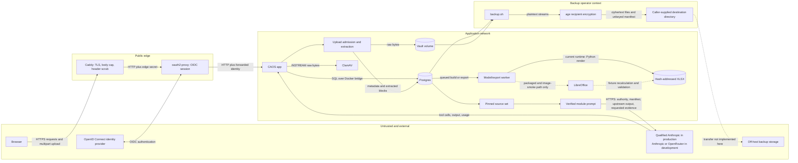

# CAOS threat model: 2026-08-30

This reference models the seven requested trust boundaries against Spoofing, Tampering, Repudiation, Information disclosure, Denial of service, and Elevation of privilege (STRIDE). It reconciles each threat with the ten non-negotiable invariants and prioritizes every threat that no invariant covers. The principal high risks are third-party provider disclosure, mutable or over-privileged storage, unisolated document processing, a runtime XLSX path that does not invoke LibreOffice, an over-privileged worker, and a backup path that neither transfers off-host nor authenticates the backup's origin.

## Scope and evidence standard

The review began on the G4 worktree rooted at commit `0d44b19cdece282498b7bcaadd7b5f533bf45f6d` and was revalidated after the concurrent G7 observability work merged. The provider and worker boundaries were revalidated again after Enterprise Task 5A-D. The cited line numbers describe the resulting enterprise-readiness worktree. The review treats uploaded bytes, browser requests, provider responses, internal network peers, the database, the backup destination, and document-derived text as potentially hostile. It trusts the host kernel, Docker daemon, and age implementation. A root or Docker-daemon compromise can bypass every in-container control and is outside this component model.

The assets are raw source bytes in the vault, extracted evidence blocks in Postgres, case membership and OIDC-derived identity, methodology authority, run and artifact lineage, provider credentials, model outputs, XLSX exports, audit events, and encrypted backups. Raw source bytes are content-addressed before storage (`caos/server/caos/sources/domain.py:57-75`), while extracted blocks and their claimed source SHA-256 are stored together in the `sources` row (`caos/server/caos/storage/store.py:62-76`).

The repository cannot verify the configured identity provider's policy, provider contractual controls, host-volume encryption, ClamAV signature-update cadence, off-host storage controls, or production monitoring. Those items remain unverified instead of being treated as present.

## Data-flow diagram

Solid arrows are implemented runtime flows. Dashed arrows are intended or operational flows whose final link is not implemented by the current runtime code.

Caddy publishes only ports 80 and 443, while every service joins one `internal` bridge (`caos/deploy/docker-compose.yml:120-145`). Caddy strips every identity header the app trusts and adds the shared edge secret before proxying (`caos/deploy/Caddyfile:6-17`). oauth2-proxy then authenticates with OpenID Connect (OIDC) and forwards user headers to the app (`caos/deploy/oauth2-proxy.cfg:1-15`).

The provider receives the bounded source manifest and validated upstream Markdown in the initial user prompt (`caos/server/caos/engine/runtime.py:810-847`), then receives exact evidence text only after an allowed `read_evidence` call (`caos/server/caos/engine/loop.py:346-365`). Agent execution is inert unless explicitly enabled. Production refuses dual credentials and OpenRouter, requires a digest-pinned, current qualification record bound to the exact Anthropic model, adapter, parameter context, and methodology, and independently rejects a non-qualified production identity in `Engine` construction (`caos/server/run.py:25-75`; `caos/server/caos/engine/provider.py:234-280`; `caos/server/caos/engine/runtime.py:108-123`). Development permits one explicit Anthropic or OpenRouter binding without requiring qualification; OpenRouter cannot claim qualification. Shared app assembly validates settings before creating resources or HTTP routes (`caos/server/run.py:78-103`). Compose supplies provider and qualification configuration only to the app; the worker receives none (`caos/deploy/docker-compose.yml:45-62`; `caos/deploy/docker-compose.yml:76-96`).

The requested worker to LibreOffice to XLSX boundary is not the current runtime flow. The worker calls `ModelService.run_export` (`caos/server/worker.py:53-65`), which aliases `run_export_for_tests`; that path calls `_render_bytes`, whose current implementation invokes the Python `render_workbook` method (`caos/server/caos/models/service.py:1003-1054`). LibreOffice is installed and exercised by the image-build smoke through `CpModelBundle.export` (`caos/deploy/Dockerfile:30-37`; `caos/deploy/verify_image_resources.py:39-63`), and that separate path invokes `soffice` with a 90-second timeout and validates the recalculated workbook (`caos/server/caos/methodology/vendor/deploy_v/skills/cp-model/scripts/cp_model_v3/builder.py:119-157`; `caos/server/caos/methodology/vendor/deploy_v/skills/cp-model/scripts/cp_model_v3/builder.py:365-418`).

The requested backup to age to off-host boundary also stops short. `backup.sh` encrypts the database and vault directly into a caller-supplied directory (`caos/deploy/backup.sh:33-76`), but no command transfers those files off-host. The script itself says destination ACLs, retention, key separation, and restore authorization are operator policy (`caos/deploy/backup.sh:12-26`).

The shipped deployment is explicitly single-instance. The app and worker each hold a role-specific PostgreSQL session advisory lock on a dedicated watchdog connection; a duplicate is refused, and a lost lock session terminates the process (`caos/deploy/docker-compose.yml:1-4`; `caos/server/caos/storage/store.py:189-244`; `caos/tests/test_single_instance.py:50-120`). This reduces accidental concurrent execution but does not turn unclaimed export work into an exactly-once operation; that residual is R-WRK-3.

## Invariant proof index

The invariant text below is copied from the governing contract without reinterpretation (`CLAUDE.md:15-40`). A later STRIDE row cites an invariant only when a named test exercises that threat. A related control is not promoted into invariant coverage.

| ID | Invariant | Named failing test on break |
|---|---|---|
| I1 | Runs execute only against the pinned, immutable source set. Supplied-only evidence; web discovery is structurally banned; withdrawal is checked live. | `test_gate_exit_pins_exact_current_source_set_and_later_uploads_do_not_move_it`, `test_withdrawing_pinned_source_mid_run_fails_the_run_closed`, `test_web_discovery_instruction_cannot_reach_a_second_tool`, and `test_cp1c_is_pinned_to_supplied_only_evidence` (`caos/tests/spec/test_runs_spec.py:74`; `caos/tests/spec/test_runs_spec.py:110`; `caos/tests/spec/test_injection_spec.py:343`; `caos/tests/spec/test_modules_spec.py:208`) |
| I2 | Every `read_evidence` is validated at the host boundary and fails closed with a typed refusal — no text ever returned on refusal. | `test_read_outside_pinned_source_set_fails_closed` and `test_no_refusal_leaks_evidence_text_or_leaves_a_citation_expectation` (`caos/tests/spec/test_evidence_spec.py:32`; `caos/tests/spec/test_evidence_spec.py:313`) |
| I3 | The host owns identity. Provider-claimed frontmatter never survives; checkpointed digests are expectations re-verified against the store. | `test_host_owns_identity_and_discards_provider_frontmatter` and `test_checkpointed_digests_are_expectations_not_authority` (`caos/tests/spec/test_modules_spec.py:121`; `caos/tests/spec/test_state_spec.py:121`) |
| I4 | Methodology authority is the verified vendored bundle — integrity checked on the bytes at use. A run pinned to one build never executes under another. The vendored bundle under `caos/server/caos/methodology/vendor/` is never edited; behavior changes ride wrappers or registry entries. | `test_vendored_bundle_is_the_approved_unmodified_release`, `test_verify_at_use_rejects_bytes_that_mismatch_the_pinned_manifest`, and `test_run_pins_build_id_and_refuses_execution_under_a_different_bundle` (`caos/tests/spec/test_modules_spec.py:48`; `caos/tests/spec/test_modules_spec.py:81`; `caos/tests/spec/test_modules_spec.py:96`) |
| I5 | Every gate where execution waits on a human is a digest-bound interrupt; approval binds the exact reviewed content (preview digest + input fingerprint). Single-actor releases (model Sign-Off) are store CAS transactions, not interrupts. | `test_approval_binds_exact_preview_digest_and_fingerprint_mismatch_leaves_frozen_retryable` and `test_sign_off_cas_is_append_only_with_separate_head_and_monotonic_order` (`caos/tests/spec/test_deliverables_spec.py:839`; `caos/tests/spec/test_model_builder_spec.py:1269`) |
| I6 | Execution is durable and exactly-once: resume from the last checkpoint, never restart. A crash in the commit gap yields one artifact, one charge, one terminal event. | `test_worker_killed_mid_run_resumes_from_last_checkpoint_not_restart` and `test_crash_between_store_commit_and_checkpoint_write_yields_one_artifact_one_charge` (`caos/tests/spec/test_runs_spec.py:233`; `caos/tests/spec/test_runs_spec.py:252`) |
| I7 | Model calculation is pure and finite — non-finite values and zero denominators refused before use. | `test_finite_guards_reject_non_finite_and_zero_denominators` (`caos/tests/spec/test_model_builder_spec.py:315`) |
| I8 | Budgets fail closed — every ceiling refuses the next operation before overspend; no provider call without a reservation. | `test_each_ceiling_refuses_the_next_operation_before_overspend` and `test_no_provider_call_without_a_successful_reservation` (`caos/tests/spec/test_budget_spec.py:126`; `caos/tests/spec/test_budget_spec.py:77`) |
| I9 | Module output survives only as the strict canonical envelope — bounded schema, undeclared fields refused, citations only from delivered evidence. | `test_canonical_output_schema_is_strict_and_bounded` and `test_forged_citation_outside_delivered_set_is_rejected_at_canonicalization` (`caos/tests/spec/test_modules_spec.py:108`; `caos/tests/spec/test_evidence_spec.py:125`) |
| I10 | A run's route is static: node set and edges are a pure function of (pathway, depth). No data-selected edges, ever. Replay from the same pins is equivalent by the same path. | `test_node_set_and_edges_are_a_pure_function_of_pathway_and_depth` and `test_replay_from_same_pinned_sources_and_build_is_equivalent_by_the_same_path` (`caos/tests/spec/test_runs_spec.py:196`; `caos/tests/spec/test_runs_spec.py:205`) |

Verification on 2026-08-31 selected every named test above: all 60 generated test cases passed.

## Residual risk register

Residual means no invariant among I1 through I10 covers the threat. Some residuals have strong non-invariant controls and therefore score below High. Score is likelihood multiplied by impact: High is 15 to 25, Medium is 8 to 14, and Low is 1 to 7.

Likelihood is scored as: 1 rare and dependent on several trusted-control failures; 2 unlikely but credible; 3 plausible in ordinary operation or under one compromise; 4 likely under expected use or a common compromise; 5 present, expected, or continuously exposed. Impact is scored as: 1 negligible; 2 limited and readily reversible; 3 material to one case or service with recovery required; 4 major multi-case, prolonged-service, or regulatory harm; 5 catastrophic confidentiality, integrity, availability, or enterprise-wide harm. These definitions are the triage rubric, not claims that production telemetry has measured occurrence rates.

| ID | Residual threat | L | I | Score | Required treatment |
|---|---|---:|---:|---:|---|
| R-EDGE-1 | A compromised trusted edge peer can forge browser identity because the app still accepts a matching shared bearer secret plus forwarded identity (`caos/server/caos/identity.py:53-84`). The worker now uses a role-specific validator and receives neither edge nor session secrets (`caos/server/caos/config.py:123-139`; `caos/deploy/docker-compose.yml:76-96`), reducing credential exposure without authenticating the remaining edge hop. | 3 | 5 | **15 High** | **Code and deployment-config fix:** replace the shared bearer assertion with authenticated service identity or a private app listener, and restrict which network peers can reach the app. |
| R-EDGE-2 | Caddy to oauth2-proxy to app uses HTTP on one shared bridge, so identity headers and the bearer edge secret lack transport confidentiality and peer authentication after TLS termination (`caos/deploy/Caddyfile:15-17`; `caos/deploy/oauth2-proxy.cfg:1-4`). | 2 | 5 | 10 Medium | Segment networks and use mutual TLS (mTLS) or a Unix socket for the trusted edge hop. |
| R-EDGE-3 | Identity-provider claim policy, group lifecycle, session revocation, and the seven-day cookie lifetime are external to this repository. The code verifies only the forwarded subject, groups, and edge secret (`caos/deploy/oauth2-proxy.cfg:5-14`; `caos/server/caos/identity.py:53-84`). | 2 | 4 | 8 Medium | Procurement and deployment control: document issuer, multi-factor authentication, group ownership, revocation service-level agreement, and session lifetime. |
| R-EDGE-4 | Request ceilings are per subject and per process, not global, and do not cap ordinary request concurrency (`caos/server/caos/api/__init__.py:107-193`). | 3 | 3 | 9 Medium | Add edge-level connection and rate limits; move counters to shared storage before scaling app instances. |
| R-EDGE-5 | Edge authentication and request logs are enabled, but the repository declares no tamper-evident central sink or retention policy (`caos/deploy/oauth2-proxy.cfg:16-18`). | 2 | 3 | 6 Low | Send logs off-host with immutable retention and correlate them with app audit IDs. |
| R-EDGE-6 | The Content Security Policy permits inline scripts, so a future HTML injection would retain a script execution path (`caos/server/caos/api/__init__.py:196-220`). | 2 | 4 | 8 Medium | Remove `unsafe-inline` when the static export can use stable hashes or nonces; retain the current regression test meanwhile. |
| R-DB-1 | The application and worker connect to Postgres without an explicit TLS mode or server certificate verification (`caos/deploy/docker-compose.yml:45-47`; `caos/deploy/docker-compose.yml:84-86`). A compromised bridge peer can target confidentiality and integrity in transit. | 3 | 5 | **15 High** | **Deployment-config fix:** require Postgres TLS with `verify-full`, a private CA, and network isolation. |
| R-DB-2 | The same `caos` credential bootstraps the database and is used by both app and worker; the deployment declares no separate read/write, migration, audit, or worker roles (`caos/deploy/docker-compose.yml:9-12`; `caos/deploy/docker-compose.yml:47`; `caos/deploy/docker-compose.yml:86`). | 4 | 5 | **20 High** | **Deployment-config fix:** create least-privilege runtime roles, a separate migration role, and a narrower worker role; rotate the shared credential. |
| R-DB-3 | Compose declares persistent Postgres and vault volumes but no at-rest encryption or key management service integration (`caos/deploy/docker-compose.yml:13-14`; `caos/deploy/docker-compose.yml:61-62`; `caos/deploy/docker-compose.yml:136-141`). | 3 | 5 | **15 High** | **Deployment-config fix:** use encrypted host or cloud volumes with managed keys and documented snapshot encryption. |
| R-DB-4 | App transactions append audit rows, but the schema has no append-only trigger, separate owner, hash chain, or external sink. A principal with the shared DB credential can update or delete history (`caos/server/caos/storage/store.py:151-159`; `caos/server/caos/storage/store.py:248-262`). I6 proves application crash exactness, not resistance to a malicious database principal. | 4 | 4 | **16 High** | **Code and deployment-config fix:** restrict runtime privileges, enforce append-only audit writes at the database boundary, and replicate audit records to an immutable external sink. |
| R-DB-5 | The deployment has a startup health check but no runtime failover, connection quota, CPU or memory limit, or database availability objective (`caos/deploy/docker-compose.yml:6-20`; `caos/server/caos/storage/store.py:183-187`). | 3 | 3 | 9 Medium | Add managed failover or a documented single-host recovery objective, pool limits, and resource limits. |
| R-CLAM-1 | The app trusts an unauthenticated clamd TCP response on a shared bridge. clamd listens on all interfaces, and the client accepts any response containing `ok` and not `found` (`caos/deploy/clamd.conf:3-6`; `caos/server/caos/sources/domain.py:78-104`). | 3 | 5 | **15 High** | **Deployment-config fix:** place app and ClamAV on a dedicated network or shared Unix socket, deny every other peer, and authenticate or locally attest the scanner process. |
| R-CLAM-2 | The source record and audit event do not retain scanner engine version, signature version, scan timestamp, or result; the audit records only case, source, and SHA-256 (`caos/server/caos/storage/store.py:394-400`). | 3 | 3 | 9 Medium | Code fix: persist a bounded scan attestation and include it in the source audit event. |
| R-CLAM-3 | Production signature freshness and update-failure behavior cannot be verified from repository code. Compose persists `/var/lib/clamav` and checks daemon responsiveness only (`caos/deploy/docker-compose.yml:22-34`). | 3 | 4 | 12 Medium | Add an explicit freshness health check and alert on signature age. |
| R-CLAM-4 | Raw confidential document bytes cross the shared bridge without encryption before ingestion can continue (`caos/server/caos/sources/domain.py:86-94`). | 2 | 4 | 8 Medium | Use a Unix socket on a private mount or a dedicated encrypted service channel. |
| R-CLAM-5 | A slow or unavailable scanner delays each upload for up to the connection timeout or returns 503. No upload-specific concurrency pool isolates scanner pressure from the app (`caos/server/caos/sources/domain.py:81-104`; `caos/server/caos/api/__init__.py:157-193`). | 3 | 3 | 9 Medium | Queue scans in an isolated bounded worker pool and alert on scanner latency and refusal rate. |
| R-ING-1 | Evidence blocks are trusted from the Postgres JSON row without re-reading the vault or verifying a block-set digest. A database mutation can change `blocks[*].text` while leaving `sources.sha256` and the six-field source-set digest unchanged (`caos/server/caos/storage/store.py:62-76`; `caos/server/caos/engine/state.py:49-63`; `caos/server/caos/engine/evidence.py:97-116`). | 3 | 5 | **15 High** | **Code fix:** content-address the extracted block set, include its digest in the pinned source projection, and recompute it before evidence delivery. |
| R-ING-2 | PDF and XLSX parsing runs synchronously inside the upload request after one bounded read. Size, row, and archive caps exist, but there is no CPU, memory, or wall-clock isolation around pypdf or openpyxl (`caos/server/caos/sources/domain.py:107-142`; `caos/server/caos/sources/domain.py:186-258`; `caos/server/caos/sources/domain.py:367-388`). | 4 | 4 | **16 High** | **Code fix:** execute extraction in a constrained worker or subprocess with time and memory limits; keep the existing admission caps. |
| R-ING-3 | Filename and media type are supplied by the uploader. The filename is reduced to a basename and a suffix selects the parser, but the source manifest still carries the attacker-selected labels (`caos/server/caos/sources/domain.py:375-392`; `caos/server/caos/engine/runtime.py:810-823`). | 3 | 3 | 9 Medium | Code fix: derive media type from admitted bytes where reliable and label filename and media type as display metadata, not provenance. |
| R-ING-4 | Loan-workbook cell text is stripped and length-bounded but is not checked for control bytes, bidirectional overrides, or Unicode Normalization Form C (NFC) before it enters the digest and rendered output (`caos/server/caos/artifacts/loan_universe.py:268-294`; `caos/server/caos/artifacts/loan_universe.py:118-130`). | 3 | 3 | 9 Medium | Code fix: apply `BoundaryText` semantics at import and return structured row findings for rejected cells. |
| R-PROV-1 | The provider receives confidential case metadata, upstream analyses, and requested evidence text. The repository contains no enforceable retention, training, residency, subcontractor, or deletion control for that third party (`caos/server/caos/engine/runtime.py:810-847`; `caos/server/caos/engine/loop.py:346-365`). | 5 | 5 | **25 High** | **Documented accepted risk:** require an approved enterprise provider contract and data processing agreement, record residency and retention choices, and offer a private or self-hosted provider when that acceptance is not available. |
| R-PROV-2 | Provider peer identity relies on normal HTTPS and the platform trust store. The code has no egress allowlist, private endpoint, certificate pin, or proxy policy (`caos/server/caos/engine/openrouter.py:64-77`; `caos/server/caos/engine/openrouter.py:130-137`; `caos/server/caos/engine/anthropic.py:77-89`). | 2 | 5 | 10 Medium | Deployment-config fix: restrict egress to approved provider endpoints and use a controlled egress proxy or private endpoint. |
| R-PROV-3 | Production deliberately binds one qualified Anthropic provider. Dual credentials and OpenRouter are refused, and one timeout retry plus typed failure bounds an outage, but there is no same-run fallback; an Anthropic outage still fails the run (`caos/server/run.py:25-75`; `caos/server/caos/engine/loop.py:246-308`). | 4 | 3 | 12 Medium | Document the availability objective and re-run policy. Do not add same-run fallback; any future second provider requires separate qualification and a new run with its own immutable identity. |
| R-PROV-4 | OpenRouter is development-only, where it reserves input budget from a local tokenizer estimate with a fixed 1.5 margin rather than an authoritative count (`caos/server/caos/engine/openrouter.py:64-77`; `caos/server/caos/engine/openrouter.py:228-234`). Production assembly refuses it and `Engine` rejects unqualified production identities, so this estimation risk does not reach the production binding. | 2 | 2 | 4 Low | Keep OpenRouter development-only. Any future production proposal must first implement and prove a separate qualification path and replace or continuously calibrate the estimate under a documented fail-closed bound. |
| R-PROV-5 | Each successfully usage-validated generation response retains the full pinned provider identity, request and normalized-response digests, bounded provider request ID, observed model/version, usage, stop reason, and retry index. Spend is reconciled and the generation row is persisted before response identity is compared or output is processed (`caos/server/caos/engine/loop.py:310-334`; `caos/server/caos/engine/runtime.py:860-878`; `caos/server/caos/responses.py:187-202`). Raw response content is intentionally not retained. That protects confidentiality, but a digest alone cannot reconstruct the response or independently prove what the provider sent. | 2 | 3 | 6 Low | Document the forensic limitation; correlate the digest and request ID with approved provider logs where available, and do not add raw prompt or response logging without a separate encrypted evidence-retention design. |
| R-WRK-1 | The production export worker does not call the LibreOffice recalculation and validation path. It renders with Python and publishes those bytes, while only the image-build fixture exercises LibreOffice (`caos/server/caos/models/service.py:1003-1054`; `caos/deploy/verify_image_resources.py:39-63`). | 4 | 5 | **20 High** | **Code fix:** route production build and revision exports through the existing `CpModelBundle.export` and `export_revision` path, then preserve the current hash-addressed publish and download verification. |
| R-WRK-2 | The worker runs document and workbook code with read/write access to the entire vault and the same broad DB credential as the app (`caos/deploy/docker-compose.yml:76-96`; `caos/server/worker.py:69-82`). It now uses a worker-specific validator and receives no edge, session, ClamAV, or provider secrets, so a compromise cannot reuse those credentials; it can still read or alter unrelated cases through the shared database and vault. | 3 | 5 | **15 High** | **Code and deployment-config fix:** use a least-privilege worker DB role and stage one export into a job-scoped directory or broker instead of mounting the whole vault read/write. |
| R-WRK-3 | Export jobs have no claim transition before rendering. The PostgreSQL singleton watchdog refuses normal duplicate workers and terminates on lock-session loss, but an executor that bypasses that deployment guard or overlaps its five-second detection interval can still render the same queued export; only the final failure update is conditional (`caos/server/caos/storage/store.py:163-165`; `caos/server/caos/storage/store.py:189-244`; `caos/server/worker.py:53-65`; `caos/server/caos/models/service.py:1011-1054`). | 2 | 3 | 6 Low | Code fix: add a compare-and-swap export claim with an execution token before any render. |
| R-WRK-4 | `libreoffice-calc` is installed without a version pin, so image rebuilds are not date-reproducible even though the base image is digest-pinned (`caos/deploy/Dockerfile:30-34`). | 3 | 3 | 9 Medium | Documented accepted risk: retain signed Debian repositories and image vulnerability gates; record the shipped package version in export provenance. |
| R-BKP-1 | The script writes one fixed backup pair into a caller-supplied directory with `mv -f`; it implements no off-host copy, immutable retention, generation naming, or remote success check (`caos/deploy/backup.sh:33-40`; `caos/deploy/backup.sh:68-77`). | 4 | 5 | **20 High** | **Deployment-config fix:** schedule transfer to versioned off-host object storage with object lock, write-only source credentials, retention policy, and monitored completion. |
| R-BKP-2 | The manifest is an unkeyed SHA-256 list stored beside the ciphertext, and encryption uses only the public age recipient. The script contains no sender signature or independent message authentication code, so destination write access can replace the dump, vault, and manifest with a self-consistent set that decrypts for the recipient (`caos/deploy/backup.sh:59-76`; `caos/deploy/restore_drill.sh:86-102`). | 3 | 5 | **15 High** | **Code and deployment-config fix:** sign a manifest that binds backup ID, time, dump digest, vault digest, and schema version with a protected signing key; verify it before decryption and retain immutable destination versions. |
| R-BKP-3 | No automated check in this repository proves a real Compose backup and restore. The drill performs substantive schema and digest checks when run, but its execution depends on external `age`, Docker, and operator credentials (`caos/deploy/restore_drill.sh:117-170`). | 4 | 5 | **20 High** | **Deployment-config fix:** run scheduled restore drills in an isolated environment, alert on failure, record recovery point and recovery time, and retain signed drill evidence. |
| R-BKP-4 | Private-key separation, annual rotation, destination access-control lists, read logging, and two-person restore authorization exist only as comments and operator policy (`caos/deploy/backup.sh:12-26`; `caos/deploy/restore_drill.sh:2-15`). | 3 | 5 | **15 High** | **Deployment-config fix:** enforce key management service or hardware security module custody, dual authorization, key rotation, and audited restore access. If enforcement is unavailable, record it as a documented accepted risk with an owner and review date. |

## STRIDE bookkeeping by boundary

Each `None` entry points to the residual register. A threat with both an invariant-covered part and a residual part keeps both; the invariant is not widened to cover the residual.

### Browser to Caddy to oauth2-proxy to app

| STRIDE | Threat and current control | Invariant reconciliation |
|---|---|---|
| Spoofing | A browser can submit forged `X-Forwarded-*` headers. Caddy removes all trusted identity headers, oauth2-proxy adds OIDC identity, and the app requires a constant-time edge-secret match before reading them (`caos/deploy/Caddyfile:11-17`; `caos/server/caos/identity.py:35-84`). The header-set agreement and production behavior have named non-invariant tests (`caos/tests/spec/test_misc_spec.py:90`; `caos/tests/spec/test_misc_spec.py:119`). Compromise of the shared secret or a trusted peer remains R-EDGE-1. | None: authentication is outside I1 through I10. |
| Tampering | Caddy owns public TLS and sets a request-body cap (`caos/deploy/Caddyfile:1-10`), while app middleware adds CSP, HSTS in production, nosniff, and framing restrictions (`caos/server/caos/api/__init__.py:196-252`). Internal hops remain cleartext, R-EDGE-2, and CSP retains `unsafe-inline`, R-EDGE-6. | None. |
| Repudiation | oauth2-proxy enables auth, request, and standard logs, while governed app writes carry actor IDs (`caos/deploy/oauth2-proxy.cfg:16-18`; `caos/server/caos/storage/store.py:248-275`). No immutable edge log sink is declared, R-EDGE-5. | None. I6 proves run exactness, not edge-log integrity. |
| Information disclosure | oauth2-proxy does not pass the access token and uses Secure, HttpOnly, SameSite=Lax cookies (`caos/deploy/oauth2-proxy.cfg:7-14`). Forwarded identity and the edge secret still cross the shared bridge in cleartext, R-EDGE-2; IdP and session policy remain unverified, R-EDGE-3. | None. |
| Denial of service | Caddy caps request bodies; the app has per-subject token buckets and explicit stream and preview concurrency slots (`caos/deploy/Caddyfile:8-10`; `caos/server/caos/api/__init__.py:107-193`). The counters remain per process and ordinary request concurrency is unbounded, R-EDGE-4. | None. I8 covers run and provider budgets, not HTTP admission. |
| Elevation of privilege | Production derives role only from OIDC groups, defaults unknown groups to reader, checks case membership, and hides unauthorized cases as 404 (`caos/server/caos/identity.py:22-32`; `caos/server/caos/identity.py:87-100`). A leaked edge bearer secret plus forged forwarded groups bypasses that edge, R-EDGE-1. | None. |

### App to Postgres

| STRIDE | Threat and current control | Invariant reconciliation |
|---|---|---|
| Spoofing | The app selects a fixed Compose DNS name and password, but the URL declares no TLS or server-certificate verification (`caos/deploy/docker-compose.yml:47`). A bridge attacker can target database peer identity, R-DB-1. | None. |
| Tampering | SQLAlchemy expressions avoid caller-built SQL strings, and governed writes group state and audit in one transaction (`caos/server/caos/storage/store.py:377-402`). A database principal can still change source blocks or audit rows, R-ING-1 and R-DB-4. | I3's `test_host_owns_identity_and_discards_provider_frontmatter` proves model identity rebuilding (`caos/tests/spec/test_modules_spec.py:121`), but it does not cover a database attacker. None for the residuals. |
| Repudiation | Audit rows carry action, actor, time, and data (`caos/server/caos/storage/store.py:151-159`; `caos/server/caos/storage/store.py:248-262`). They are not database-enforced append-only or externally anchored, R-DB-4. | I6's `test_crash_between_store_commit_and_checkpoint_write_yields_one_artifact_one_charge` proves one terminal effect across an app crash (`caos/tests/spec/test_runs_spec.py:252`), not malicious audit deletion. |
| Information disclosure | Postgres is not host-published, but all services share the bridge and persistent volume (`caos/deploy/docker-compose.yml:13-20`; `caos/deploy/docker-compose.yml:136-145`). Transport and at-rest protections remain R-DB-1 and R-DB-3. | None. |
| Denial of service | A health check gates app startup (`caos/deploy/docker-compose.yml:15-19`; `caos/deploy/docker-compose.yml:42-44`). Runtime high availability and resource controls are absent, R-DB-5. | I6's `test_worker_killed_mid_run_resumes_from_last_checkpoint_not_restart` proves run recovery after an engine process restart (`caos/tests/spec/test_runs_spec.py:233`), not database availability. |
| Elevation of privilege | App and worker share the bootstrap credential with no declared least-privilege roles, R-DB-2. | None. |

### App to ClamAV

| STRIDE | Threat and current control | Invariant reconciliation |
|---|---|---|
| Spoofing | Production fails closed when the scanner is absent or returns an unusable response (`caos/server/caos/sources/domain.py:81-104`), but the raw TCP peer is unauthenticated, R-CLAM-1. | None. Malware scanning is not one of I1 through I10. |
| Tampering | Bytes are scanned before archive validation, extraction, vault write, or source-set creation (`caos/server/caos/sources/domain.py:367-402`). A forged `ok` response on the shared network bypasses that order, R-CLAM-1. | None. |
| Repudiation | The EICAR path has a named non-invariant test (`caos/tests/test_source_ingestion.py:199`), but no scan attestation is stored, R-CLAM-2. | None. |
| Information disclosure | Full source bytes are sent to clamd over cleartext TCP, R-CLAM-4. | None. |
| Denial of service | Scanner connection failures return 503 rather than admitting unscanned content (`caos/server/caos/sources/domain.py:83-104`). This preserves security but makes scanner availability an upload dependency; freshness is R-CLAM-3 and capacity is R-CLAM-5. | None. |
| Elevation of privilege | clamd listens on every interface of the shared bridge, so any compromised peer can reach its command surface, R-CLAM-1. The container and network configuration show no service-specific isolation (`caos/deploy/clamd.conf:3-6`; `caos/deploy/docker-compose.yml:22-34`). | None. |

### Uploaded document to ingestion to pinned set to module prompt

| STRIDE | Threat and current control | Invariant reconciliation |
|---|---|---|
| Spoofing | A document can name a foreign, withdrawn, or post-pin source. Membership, case, and withdrawal are re-read on every evidence call (`caos/server/caos/engine/evidence.py:62-79`). Attacker-selected display metadata remains R-ING-3. | I1: `test_withdrawing_pinned_source_mid_run_fails_the_run_closed` (`caos/tests/spec/test_runs_spec.py:110`). I2: `test_read_outside_pinned_source_set_fails_closed` (`caos/tests/spec/test_evidence_spec.py:32`). None for provenance semantics. |
| Tampering | Uploads are size-bounded, scanned, archive-screened, hashed, extracted, and atomically added to a versioned source set (`caos/server/caos/sources/domain.py:367-402`; `caos/server/caos/storage/store.py:337-402`). Later source-set membership changes do not move the pin, but Postgres block-text mutation is not detected, R-ING-1. | I1: `test_gate_exit_pins_exact_current_source_set_and_later_uploads_do_not_move_it` (`caos/tests/spec/test_runs_spec.py:74`). I3 only re-verifies the stored expectation; it does not authenticate the store. None for R-ING-1. |
| Repudiation | Ingest and withdrawal write actor-bound audit events in the same transaction as state (`caos/server/caos/storage/store.py:377-425`). Scanner provenance is absent, R-CLAM-2. | None. Transactional audit is a standing rule, not one of the ten invariants. |
| Information disclosure | A refused evidence read returns no rows and does not update the delivered set (`caos/server/caos/engine/evidence.py:81-145`). Authorized evidence text is intentionally sent to the provider, R-PROV-1. | I2: `test_read_outside_pinned_source_set_fails_closed` plus the literal no-leak enumeration `test_no_refusal_leaks_evidence_text_or_leaves_a_citation_expectation` (`caos/tests/spec/test_evidence_spec.py:32`; `caos/tests/spec/test_evidence_spec.py:313`). None for intended third-party disclosure. |
| Denial of service | Upload bytes, archive expansion, extracted text, worksheet rows, columns, blocks, evidence reads, and prompt manifest are bounded (`caos/server/caos/sources/domain.py:22-48`; `caos/server/caos/sources/domain.py:107-142`; `caos/server/caos/engine/evidence.py:81-129`). Parser CPU and memory are not isolated, R-ING-2. | I8: `test_each_ceiling_refuses_the_next_operation_before_overspend` proves run-budget refusal (`caos/tests/spec/test_budget_spec.py:126`). It does not cover upload-parser resource use. |
| Elevation of privilege | Source-derived values stay in an explicitly untrusted user prompt, and the system prompt is verified methodology only (`caos/server/caos/engine/authority.py:71-100`). Provider identity is rebuilt, tool access is limited to one strict evidence tool, and citations must equal delivered evidence (`caos/server/caos/engine/provider.py:15-28`; `caos/server/caos/engine/runtime.py:911-928`; `caos/server/caos/methodology/canonical.py:140-180`). Loan-workbook display text has a separate Unicode rendering gap, R-ING-4. | I1/I2: pin and host evidence boundary tests above. I3: `test_host_owns_identity_and_discards_provider_frontmatter` (`caos/tests/spec/test_modules_spec.py:121`). I4: `test_verify_at_use_rejects_bytes_that_mismatch_the_pinned_manifest` (`caos/tests/spec/test_modules_spec.py:81`). I9: `test_canonical_output_schema_is_strict_and_bounded` (`caos/tests/spec/test_modules_spec.py:108`). None for R-ING-4. |

### App to provider

| STRIDE | Threat and current control | Invariant reconciliation |
|---|---|---|
| Spoofing | Production startup accepts only a current, digest-pinned Anthropic qualification; the run pins that full provider identity. After every successfully usage-validated response, billed spend and a bounded generation row are committed before the host compares observed model/version with the run pin and refuses a mismatch before tool or output processing (`caos/server/caos/engine/provider.py:90-168`; `caos/server/caos/engine/loop.py:310-336`). Provider-authored module, run, build, and source claims are also discarded and rebuilt. Network-level peer identity still depends on ordinary HTTPS, R-PROV-2. | I3: `test_host_owns_identity_and_discards_provider_frontmatter` (`caos/tests/spec/test_modules_spec.py:121`). None for network peer policy. |
| Tampering | The provider can return undeclared fields, malformed usage, forged citations, unexpected tools, bad stop reasons, or a substituted model identity. Host parsing and canonicalization refuse each class. Malformed usage produces a bounded terminal code; for usage-valid responses, the normalized response digest and observed identity are retained before content is acted upon (`caos/server/caos/engine/loop.py:270-334`; `caos/server/caos/engine/runtime.py:951-962`). | I2: `test_read_outside_pinned_source_set_fails_closed` (`caos/tests/spec/test_evidence_spec.py:32`). I3: host identity test above. I9: `test_canonical_output_schema_is_strict_and_bounded` and `test_forged_citation_outside_delivered_set_is_rejected_at_canonicalization` (`caos/tests/spec/test_modules_spec.py:108`; `caos/tests/spec/test_evidence_spec.py:125`). |
| Repudiation | For each usage-valid generation row, the host records the pinned provider identity, request and normalized-response digests, bounded request ID, observed model/version, usage, stop reason, and retry index. Terminal rows retain only their applicable bounded subset. Raw response content is intentionally not retained, R-PROV-5. | I8: `test_no_provider_call_without_a_successful_reservation` proves the durable pre-call reservation (`caos/tests/spec/test_budget_spec.py:77`). It does not prove provider non-repudiation. |
| Information disclosure | The provider receives the manifest, upstream Markdown, and requested evidence. Refused reads leak no text, but authorized disclosure is the product flow, R-PROV-1. | I2 proves refusal secrecy with `test_no_refusal_leaks_evidence_text_or_leaves_a_citation_expectation` (`caos/tests/spec/test_evidence_spec.py:313`). None covers provider retention, residency, or training. |
| Denial of service | Provider slots, per-call timeout, one byte-identical retry, token budgets, and fail-closed unresolved reservations bound resource use (`caos/server/caos/engine/loop.py:124-142`; `caos/server/caos/engine/loop.py:222-334`). The single qualified production provider can still be unavailable, R-PROV-3. OpenRouter's estimate remains only a development residual, R-PROV-4. | I8: `test_each_ceiling_refuses_the_next_operation_before_overspend`, `test_no_provider_call_without_a_successful_reservation`, and `test_unresolved_inflight_reservation_fails_closed_on_resume_without_respend` (`caos/tests/spec/test_budget_spec.py:126`; `caos/tests/spec/test_budget_spec.py:77`; `caos/tests/spec/test_budget_spec.py:88`). None proves external availability or development estimate exactness. |
| Elevation of privilege | The provider has exactly one strict tool. Wrong tool names and malformed arguments fail, and evidence authority is checked again in the host (`caos/server/caos/engine/provider.py:15-28`; `caos/server/caos/engine/loop.py:100-113`; `caos/server/caos/engine/evidence.py:62-101`). | I1: pinned and supplied-only test `test_gate_exit_pins_exact_current_source_set_and_later_uploads_do_not_move_it` (`caos/tests/spec/test_runs_spec.py:74`). I2: boundary test above. I9: strict schema test above. |

### Worker to LibreOffice to XLSX

| STRIDE | Threat and current control | Invariant reconciliation |
|---|---|---|
| Spoofing | The vendored builder resolves `soffice` from PATH and records its reported version (`caos/server/caos/methodology/vendor/deploy_v/skills/cp-model/scripts/cp_model_v3/builder.py:88-116`). The image is read-only and runs as non-root, but no invariant authenticates the LibreOffice binary; package version is not pinned, R-WRK-4. | None. I4 covers methodology files, not system packages. |
| Tampering | The LibreOffice path validates worksheet registry, formula inventory, finite cached values, and semantic expectations before exclusive publish (`caos/server/caos/methodology/vendor/deploy_v/skills/cp-model/scripts/cp_model_v3/builder.py:159-222`; `caos/server/caos/methodology/vendor/deploy_v/skills/cp-model/scripts/cp_model_v3/builder.py:393-421`). The runtime worker bypasses this path, R-WRK-1. Published bytes are hash-addressed and verified on download (`caos/server/caos/models/service.py:988-1001`; `caos/server/caos/models/service.py:1056-1076`). | I7: `test_finite_guards_reject_non_finite_and_zero_denominators` proves model calculation finiteness (`caos/tests/spec/test_model_builder_spec.py:315`). It does not prove XLSX recalculation. None for R-WRK-1. |
| Repudiation | Export records retain SHA-256, size, and vault key, but export execution has no claim token; a second executor that bypasses or briefly overlaps the singleton guard can perform the same render, R-WRK-3. | I6's crash-gap tests apply to run modules, not model exports. None. |
| Information disclosure | The worker runs non-root with all Linux capabilities dropped and a read-only root filesystem. It receives only its environment selector, database URL, and vault location, and failures log only the exception class in a bounded structured event (`caos/deploy/docker-compose.yml:76-96`; `caos/server/worker.py:29-65`). The whole vault and broad shared DB credential remain exposed to a worker compromise, R-WRK-2. | None. |
| Denial of service | The vendored LibreOffice call has a 90-second timeout, and one failed item does not kill the poll loop (`caos/server/caos/methodology/vendor/deploy_v/skills/cp-model/scripts/cp_model_v3/builder.py:119-157`; `caos/server/worker.py:34-65`). An executor that bypasses or briefly overlaps the singleton can waste the same render capacity, R-WRK-3. | None. I8 meters provider and run work, not exports. |
| Elevation of privilege | A LibreOffice or worker compromise executes as the `caos` user without capabilities and has no edge or provider credentials, but that user still has broad shared DB and whole-vault access rather than a job-scoped capability, R-WRK-2. | None. |

### Backup to age to off-host

| STRIDE | Threat and current control | Invariant reconciliation |
|---|---|---|
| Spoofing | `age -r` encrypts to the configured recipient, but the backup set has no sender signature or independently authenticated manifest, R-BKP-2. The restore accepts any self-consistent pair that decrypts for the identity (`caos/deploy/restore_drill.sh:86-124`). | None. Backups are outside I1 through I10. |
| Tampering | Plaintext is piped directly into age, ciphertext is non-empty checked, and restore checks manifest hashes plus age decryption (`caos/deploy/backup.sh:55-76`; `caos/deploy/restore_drill.sh:86-124`). Replacement of the entire self-consistent set remains R-BKP-2, and overwriting fixed filenames removes local version history, R-BKP-1. | None. |
| Repudiation | The script prints a destination and recipient but creates no signed backup ID, remote receipt, operator identity, or immutable audit record (`caos/deploy/backup.sh:68-77`). | None: R-BKP-1 and R-BKP-2. |
| Information disclosure | Database and vault plaintext are never written as host files; both streams enter age directly (`caos/deploy/backup.sh:55-67`). Private-key separation and restore access are policy only, R-BKP-4. | None. |
| Denial of service | `set -euo pipefail`, non-empty checks, a lock directory, and restore integrity checks catch many partial failures (`caos/deploy/backup.sh:27-67`; `caos/deploy/restore_drill.sh:117-170`). No off-host immutable versions or automated drills prove recoverability, R-BKP-1 and R-BKP-3. | None. |
| Elevation of privilege | Restoring reconstructs the full corpus. The script requires an identity file and restricts drill database and volume names, but dual authorization and key custody are not enforced (`caos/deploy/restore_drill.sh:12-60`). | None: R-BKP-4. |

## Coverage conclusion

The ten invariants strongly constrain agent authority, evidence access, methodology integrity, approval binding, durable execution, finite calculation, budgets, canonical output, and route determinism. They do not cover perimeter authentication, internal transport, database least privilege or at-rest encryption, malware-scanner authenticity, parser isolation, third-party data governance, XLSX process isolation, or backup custody and recoverability. Treating any of those as implied by I1 through I10 would weaken the invariants rather than close the threats.

The remediation performed with this review restores and independently pins the approved vendored methodology bytes, makes the production singleton lock fail closed after session loss, refuses corpus-fetch redirects, and makes corpus citations traceable to actual tool results (`caos/tests/spec/test_modules_spec.py:48-67`; `caos/server/caos/storage/store.py:189-244`; `caos/tests/corpus/fetch.sh:17-39`; `caos/tests/test_corpus_pathways.py:164-215`). Task 5A-D additionally removes credential-precedence fallback in production, enforces a qualified immutable provider identity through attempts and accepted outputs, records privacy-safe response digests, and removes unrelated secrets from the worker. Provider contractual governance, same-provider outage, response-content non-repudiation, and the worker's broad database and vault access remain residual risks; none of the new controls is treated as coverage for them.
